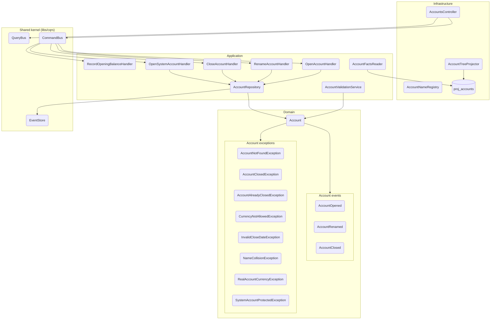

# Módulo: accounts (apps/ledger)

> C4 Nivel 3 · documentación viva. El diagrama de componentes vive acá; cada flujo lleva
> su diagrama de secuencia inline en [`flows/`](./flows/). Este README es el arc42-lite
> del módulo: propósito, invariantes y lenguaje ubicuo.

## Propósito

Gestiona el ciclo de vida de las cuentas contables del ledger: apertura, renombre,
cierre y las lecturas del árbol de cuentas y sus saldos. Es un módulo event-sourced:
cada transición de estado emite un evento de dominio persistido en el `EventStore`.

## Diagramas

**Componentes (C4 Nivel 3).** Los nodos nombran la clase real; el gate de CI
(`npm run docs:validate`) falla si alguno deja de existir.

**Flujos:** ver [`flows/`](./flows/) — cada uno lleva su `sequenceDiagram` inline,
renderizado nativo en GitHub y en el preview de VS Code.

## Casos de uso (flujos)

| Caso de uso | Trigger | Entrypoint | Doc |
|---|---|---|---|
| Abrir cuenta | rest | `POST /accounts` | [open-account](./flows/open-account.md) |
| Renombrar cuenta | rest | `POST /accounts/{id}/rename` | [rename-account](./flows/rename-account.md) |
| Cerrar cuenta | rest | `POST /accounts/{id}/close` | [close-account](./flows/close-account.md) |
| **Registrar saldo inicial** | rest | `POST /accounts/{id}/opening-balance` | [record-opening-balance](./flows/record-opening-balance.md) |
| Listar cuentas (lista plana) | rest | `GET /accounts` | [list-accounts](./flows/list-accounts.md) |
| Consultar cuenta | rest | `GET /accounts/{id}` | [get-account-by-id](./flows/get-account-by-id.md) |
| Consultar saldos | rest | `GET /accounts/{id}/balance` | [get-account-balances](./flows/get-account-balances.md) |

> **Nota de contrato (hu-0013).** Las cuatro lecturas devuelven la fila de proyección tal
> cual, en `snake_case`; los DTO de respuesta decoran Swagger pero no se construyen. Los
> parámetros `?view` (lista) y `?currency` (saldos) se aceptan y se ignoran, y un recurso
> inexistente responde `200 null` en vez de `404`. Detalle en cada flujo y en
> [`api.yaml`](./api.yaml).

## Invariantes de dominio

| ID | Regla |
|---|---|
| AC-2 | Una cuenta real acepta una única moneda; las cuentas de agregación pueden multi-moneda. |
| INV-3 / INV-4 | Validación cruzada de jerarquía y tipo de cuenta (`AccountValidationService`). |
| INV-13 | Las cuentas de sistema están protegidas: no se renombran ni cierran. |
| INV-14 | El tipo raíz de una cuenta es inmutable. |

## Lenguaje ubicuo

- **Account:** agregado que representa una cuenta contable; su identidad es estable
  y su estado se reconstruye desde sus eventos.
- **Account tree:** proyección jerárquica de las cuentas (`proj_accounts`).
- **System account:** cuenta creada por el sistema (p. ej. al inicializar el ledger),
  protegida contra renombre y cierre.

## Contrato

- OpenAPI canónico del módulo: [`api.yaml`](./api.yaml).
