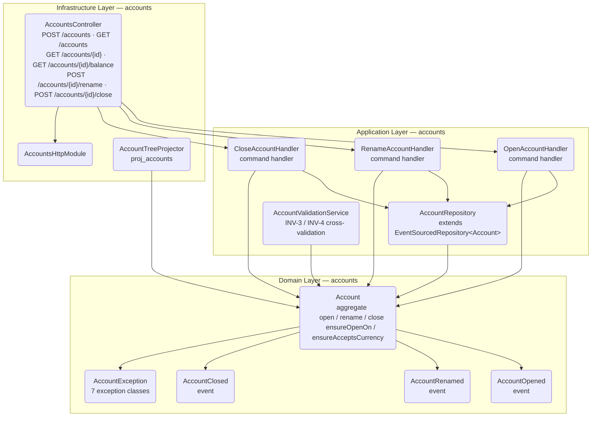
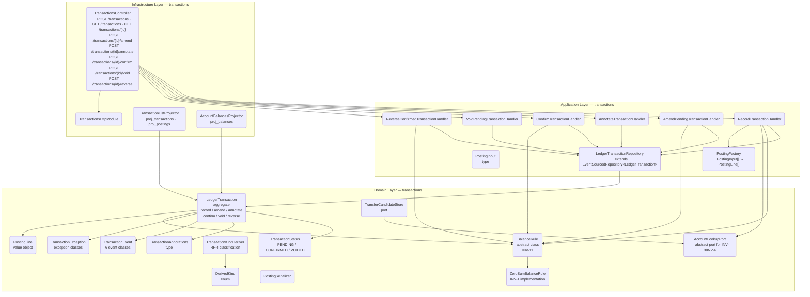

# Componentes: accounts + transactions (apps/ledger)

> C4 Nivel 3 — building blocks internos de los módulos `accounts/` y `transactions/`.
> Documento acumulativo: incluye componentes de `hu-0003` (EP-1.6 + EP-1.7).

## accounts

## transactions

## Componentes nuevos en hu-0003

| Módulo | Componente | Capa | Descripción |
|---|---|---|---|
| accounts | `Account` | Domain | Agregado event-sourced con open/rename/close |
| accounts | `AccountOpened`, `AccountRenamed`, `AccountClosed` | Domain | Eventos del ciclo de vida |
| accounts | `AccountException` (7 clases) | Domain | Excepciones de dominio |
| accounts | `AccountRepository` | Application | Persistencia vía EventStore |
| accounts | `AccountValidationService` | Application | Validación cruzada (INV-3/INV-4) |
| accounts | `OpenAccountHandler`, `RenameAccountHandler`, `CloseAccountHandler` | Application | Command handlers |
| accounts | `AccountsController` | Infrastructure | Endpoints HTTP |
| accounts | `AccountsHttpModule` | Infrastructure | Módulo NestJS |
| accounts | `AccountTreeProjector` | Infrastructure | Proyección account_tree |
| transactions | `LedgerTransaction` | Domain | Agregado event-sourced con record/amend/annotate/confirm/void/reverse |
| transactions | `BalanceRule` / `ZeroSumBalanceRule` | Domain | Balanceo a cero por moneda (INV-1/INV-11) |
| transactions | `PostingLine`, `PostingSerializer` | Domain | Value object de posting |
| transactions | `TransactionStatus`, `TransactionAnnotations` | Domain | Tipos de estado y anotaciones |
| transactions | `DerivedKind`, `TransactionKindDeriver` | Domain | Clasificación RF-4 |
| transactions | `LedgerTransactionRepository` | Application | Persistencia vía EventStore |
| transactions | 6 command handlers | Application | Record, Amend, Annotate, Confirm, Void, Reverse |
| transactions | `TransactionsController` | Infrastructure | Endpoints HTTP |
| transactions | `TransactionsHttpModule` | Infrastructure | Módulo NestJS |
| transactions | `TransactionListProjector`, `AccountBalancesProjector` | Infrastructure | Proyecciones |

## Componentes existentes (sin cambios)

- `AggregateRoot<TId>` (`shared-kernel/domain/`) — base de los dos agregados
- `EventSourcedRepository<TAggregate>` (`shared-kernel/application/`) — repositorio genérico
- `EventStore` (`shared-kernel/domain/ports/`) — puerto de almacenamiento de eventos
- `InMemoryEventStore` / `PostgresEventStore` (`shared-kernel/infrastructure/`) — implementaciones
- `EnvelopeFactory`, `EventRegistry` (`shared-kernel/application/`) — serialización de eventos
- `AccountName`, `AccountType`, `CurrencyCode`, `LedgerDate`, `Payee` — value objects (`shared-kernel/domain/value-objects/`)
- `Clock`, `IdGenerator` (`shared/domain/ports/`) — puertos de sistema
- Jerarquía `DomainException` (`libs/shared/`) — excepciones base
