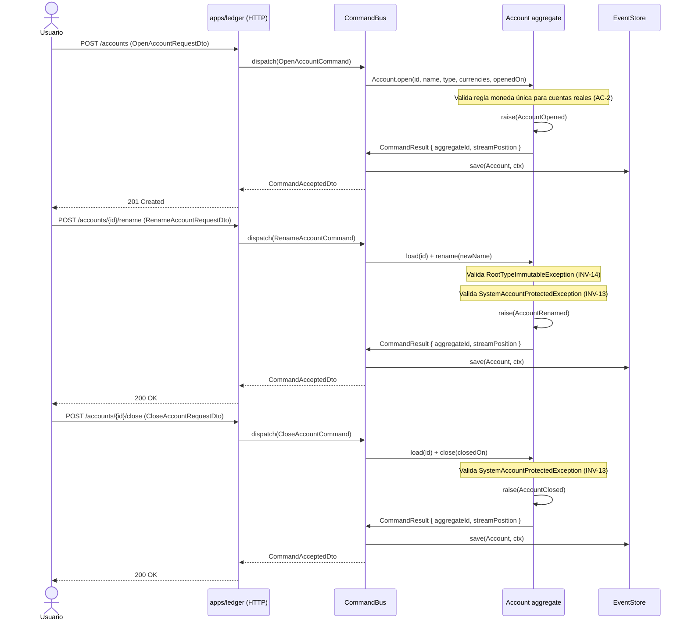
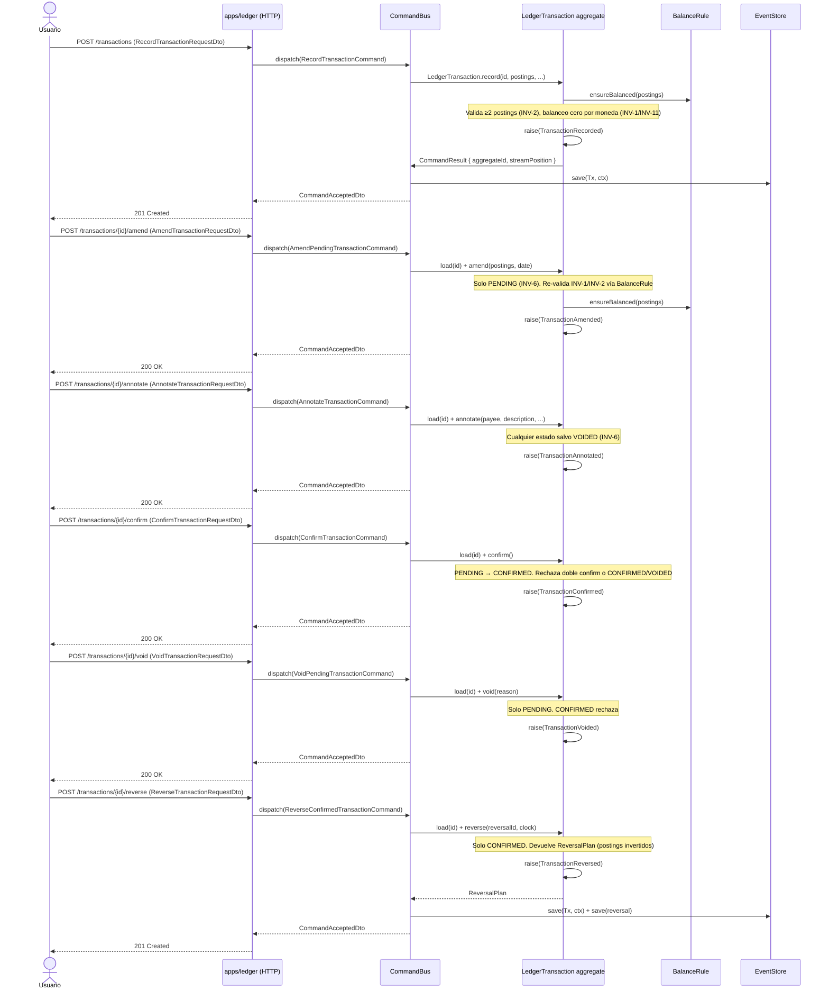

# Diagrama de flujo: hu-0003

## Account — apertura, renombre, cierre

```mermaid
sequenceDiagram
  actor Usuario
  participant HTTP as apps/ledger (HTTP)
  participant Bus as CommandBus
  participant Account as Account aggregate
  participant EventStore as EventStore

  Usuario->>HTTP: POST /accounts (OpenAccountRequestDto)
  HTTP->>Bus: dispatch(OpenAccountCommand)
  Bus->>Account: Account.open(id, name, type, currencies, openedOn)
  Note over Account: Valida regla moneda única para cuentas reales (AC-2)
  Account->>Account: raise(AccountOpened)
  Account->>Bus: CommandResult { aggregateId, streamPosition }
  Bus->>EventStore: save(Account, ctx)
  Bus-->>HTTP: CommandAcceptedDto
  HTTP-->>Usuario: 201 Created

  Usuario->>HTTP: POST /accounts/{id}/rename (RenameAccountRequestDto)
  HTTP->>Bus: dispatch(RenameAccountCommand)
  Bus->>Account: load(id) + rename(newName)
  Note over Account: Valida RootTypeImmutableException (INV-14)
  Note over Account: Valida SystemAccountProtectedException (INV-13)
  Account->>Account: raise(AccountRenamed)
  Account->>Bus: CommandResult { aggregateId, streamPosition }
  Bus->>EventStore: save(Account, ctx)
  Bus-->>HTTP: CommandAcceptedDto
  HTTP-->>Usuario: 200 OK

  Usuario->>HTTP: POST /accounts/{id}/close (CloseAccountRequestDto)
  HTTP->>Bus: dispatch(CloseAccountCommand)
  Bus->>Account: load(id) + close(closedOn)
  Note over Account: Valida SystemAccountProtectedException (INV-13)
  Account->>Account: raise(AccountClosed)
  Account->>Bus: CommandResult { aggregateId, streamPosition }
  Bus->>EventStore: save(Account, ctx)
  Bus-->>HTTP: CommandAcceptedDto
  HTTP-->>Usuario: 200 OK
```

## LedgerTransaction — registro, enmienda, anotación, confirmación, anulación, reversa

```mermaid
sequenceDiagram
  actor Usuario
  participant HTTP as apps/ledger (HTTP)
  participant Bus as CommandBus
  participant Tx as LedgerTransaction aggregate
  participant BR as BalanceRule
  participant EventStore as EventStore

  Usuario->>HTTP: POST /transactions (RecordTransactionRequestDto)
  HTTP->>Bus: dispatch(RecordTransactionCommand)
  Bus->>Tx: LedgerTransaction.record(id, postings, ...)
  Tx->>BR: ensureBalanced(postings)
  Note over Tx: Valida ≥2 postings (INV-2), balanceo cero por moneda (INV-1/INV-11)
  Tx->>Tx: raise(TransactionRecorded)
  Tx->>Bus: CommandResult { aggregateId, streamPosition }
  Bus->>EventStore: save(Tx, ctx)
  Bus-->>HTTP: CommandAcceptedDto
  HTTP-->>Usuario: 201 Created

  Usuario->>HTTP: POST /transactions/{id}/amend (AmendTransactionRequestDto)
  HTTP->>Bus: dispatch(AmendPendingTransactionCommand)
  Bus->>Tx: load(id) + amend(postings, date)
  Note over Tx: Solo PENDING (INV-6). Re-valida INV-1/INV-2 vía BalanceRule
  Tx->>BR: ensureBalanced(postings)
  Tx->>Tx: raise(TransactionAmended)
  Bus-->>HTTP: CommandAcceptedDto
  HTTP-->>Usuario: 200 OK

  Usuario->>HTTP: POST /transactions/{id}/annotate (AnnotateTransactionRequestDto)
  HTTP->>Bus: dispatch(AnnotateTransactionCommand)
  Bus->>Tx: load(id) + annotate(payee, description, ...)
  Note over Tx: Cualquier estado salvo VOIDED (INV-6)
  Tx->>Tx: raise(TransactionAnnotated)
  Bus-->>HTTP: CommandAcceptedDto
  HTTP-->>Usuario: 200 OK

  Usuario->>HTTP: POST /transactions/{id}/confirm (ConfirmTransactionRequestDto)
  HTTP->>Bus: dispatch(ConfirmTransactionCommand)
  Bus->>Tx: load(id) + confirm()
  Note over Tx: PENDING → CONFIRMED. Rechaza doble confirm o CONFIRMED/VOIDED
  Tx->>Tx: raise(TransactionConfirmed)
  Bus-->>HTTP: CommandAcceptedDto
  HTTP-->>Usuario: 200 OK

  Usuario->>HTTP: POST /transactions/{id}/void (VoidTransactionRequestDto)
  HTTP->>Bus: dispatch(VoidPendingTransactionCommand)
  Bus->>Tx: load(id) + void(reason)
  Note over Tx: Solo PENDING. CONFIRMED rechaza
  Tx->>Tx: raise(TransactionVoided)
  Bus-->>HTTP: CommandAcceptedDto
  HTTP-->>Usuario: 200 OK

  Usuario->>HTTP: POST /transactions/{id}/reverse (ReverseTransactionRequestDto)
  HTTP->>Bus: dispatch(ReverseConfirmedTransactionCommand)
  Bus->>Tx: load(id) + reverse(reversalId, clock)
  Note over Tx: Solo CONFIRMED. Devuelve ReversalPlan (postings invertidos)
  Tx->>Tx: raise(TransactionReversed)
  Tx-->>Bus: ReversalPlan
  Bus->>EventStore: save(Tx, ctx) + save(reversal)
  Bus-->>HTTP: CommandAcceptedDto
  HTTP-->>Usuario: 201 Created
```
