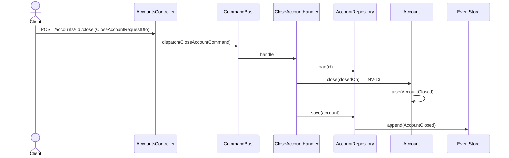

# Cerrar cuenta

Marca una cuenta como cerrada a partir de una fecha. Transición de ciclo de vida
event-sourced. El `CloseAccountHandler` rehidrata el agregado, aplica `close(closedOn)`
y persiste `AccountClosed`.

## Reglas

- **INV-13:** las cuentas de sistema no se cierran.
- El `closedOn` no puede ser anterior a la apertura de la cuenta.

## Errores

| Condición | Excepción | HTTP |
|---|---|---|
| Cuenta de sistema | `SystemAccountProtectedException` | 409 |
| Fecha de cierre anterior a la apertura | `InvalidCloseDateException` | 422 |
| Cuenta inexistente | `AccountNotFoundException` | 404 |

## Respuesta

`200 OK` con `CommandAcceptedDto`.
