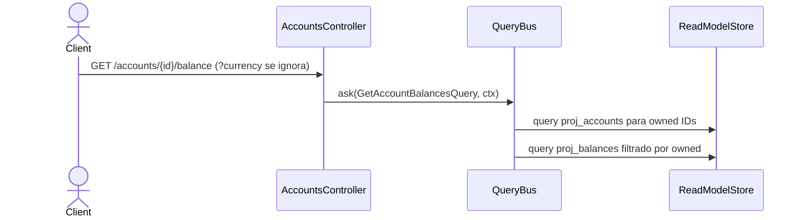

# Consultar saldos

`GetAccountBalancesHandler` devuelve los saldos confirmados y pendientes por moneda de una
cuenta (o de todas las cuentas del usuario si no se especifica `accountId`). Lee de
`proj_balances` y cruza con `proj_accounts` para garantizar aislamiento por usuario (INV-9).

El balance **nunca se escribe** (INV-5): es exclusivamente proyección.

**`?currency` se acepta y se ignora.** `AccountBalanceQueryDto` valida el parámetro, pero el
controller lo recibe como `_query` y no lo transporta: la respuesta siempre trae todas las
monedas de la cuenta. Filtrar por moneda queda del lado del cliente (hu-0013, AC-5).

## Reglas

- **AC-7:** Devuelve `confirmed_amount` y `pending_amount` por moneda. Cuando se
  especifica `accountId`, filtra a esa única cuenta; sin `accountId`, devuelve todas
  las cuentas del usuario.
- **AC-10:** devuelve `BalanceRow[]` cruda en `snake_case`, no `AccountBalanceDto[]` — el
  `@ApiOkResponse({ type: [AccountBalanceDto] })` documenta una forma que el runtime no
  construye.
- **AC-8 (INV-9):** `proj_balances` no tiene `user_id`. El handler primero obtiene los
  `account_id` del usuario desde `proj_accounts`, luego filtra los balances que
  pertenecen a esas cuentas. Ningún dato de otro usuario se filtra.
- **RNF-10:** Solo lectura — el handler no escribe ni accede al `EventStore`.

## Errores

| Condición | Excepción | HTTP |
|---|---|---|
| Cuenta no pertenece al usuario | N/A | Array vacío (no es error — es filtro) |
| Query type sin handler registrado | `UnregisteredQueryException` | Depende del controller |

## Respuesta

`200`: `BalanceRow[]` — lista de saldos con `account_id`, `currency_code`,
`confirmed_amount`, `pending_amount`. Si se especificó `accountId`, el array tiene a lo
sumo una entrada por moneda de esa cuenta.
