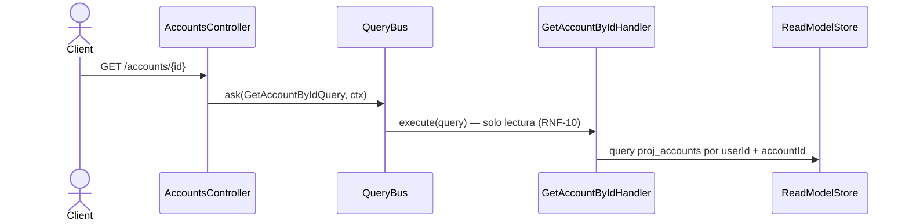

# Consultar una cuenta

Devuelve un único nodo de `proj_accounts`, acotado al usuario del contexto.

Una cuenta inexistente devuelve `200` con cuerpo `null`, no `404`: el handler retorna
`row ?? null` y ninguna capa lo traduce a excepción (hu-0013, AC-4).

## Reglas

- **AC-4 — una cuenta inexistente responde `200` con cuerpo `null`, no `404`.**
  `GetAccountByIdHandler` hace `return row ?? null` y ninguna capa traduce ese `null` a
  excepción. `ACCOUNT_NOT_FOUND` existe en el catálogo RF-14 pero **esta ruta no lo emite**;
  lo emiten los handlers de escritura al cargar una cuenta inexistente. El cliente debe
  chequear cuerpo nulo, no status.
- **AC-10 — devuelve la fila cruda** (`account_id`, `user_id`, `name`, … en `snake_case`),
  no un `AccountDto`. Ver el mismo apartado en
  [`get-ledger-settings.md`](./get-ledger-settings.md).
- **INV-9:** el filtro por `user_id` va en el criteria, así que el id de otro usuario es
  indistinguible de uno inexistente — ambos devuelven `null`. Es el comportamiento deseado:
  no filtra existencia entre usuarios.
- **RNF-10:** solo lectura.

## Errores

| Condición | Resultado | HTTP |
|---|---|---|
| Cuenta inexistente | Cuerpo `null` | 200 |
| Cuenta de otro usuario | Cuerpo `null` (indistinguible de inexistente) | 200 |
| Sin contexto autenticado | `UnauthorizedException` (`LedgerContextGuard`) | 401 |

## Respuesta

`200`: `AccountRow` cruda, o `null`.
