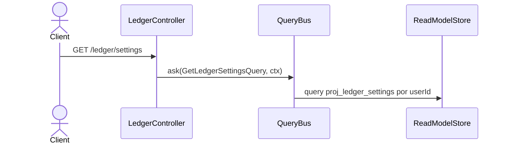

# Leer settings del ledger

Lectura pura de la proyección de settings: moneda de presentación y timezone del usuario.
Las mutaciones (`ChangePresentationCurrency`, `ChangeTimezone`) pertenecen a EP-4.1 y
**no** están expuestas por esta ruta.

Lectura pura de la proyección de settings. Devuelve la fila cruda (snake_case), no un
`LedgerSettingsDto` (hu-0013, AC-10).

## Reglas

- **AC-2:** `GET /ledger/settings` responde `200` con la fila de la proyección de settings
  del usuario del contexto.
- **AC-10 — devuelve la fila cruda, no un DTO.** `GetLedgerSettingsHandler` retorna
  `Nullable<LedgerSettingsRow>` en `snake_case` (`presentation_currency`, …). El
  `LedgerSettingsDto` existe y decora Swagger vía `@ApiOkResponse`, pero no se construye:
  `queryBus.ask<LedgerSettingsDto>(...)` es un genérico sin verificación que no transforma.
  El contrato publicado y la respuesta real difieren en el naming de los campos.
- **INV-9:** la lectura se acota al `user_id` del contexto.
- **RNF-10:** solo lectura — el handler no toca el `EventStore`.

## Errores

| Condición | Resultado | HTTP |
|---|---|---|
| Ledger sin inicializar (sin fila de settings) | Cuerpo `null` | 200 |
| Sin contexto autenticado | `UnauthorizedException` (`LedgerContextGuard`) | 401 |

> Un ledger sin inicializar devuelve `200 null`, no `422 LEDGER_NOT_INITIALIZED`: ese
> código lo emiten los lectores de EP-3 (`read-model-ledger-settings-reader`), no esta ruta.

## Respuesta

`200`: `LedgerSettingsRow` cruda, o `null` si el ledger no fue inicializado.
