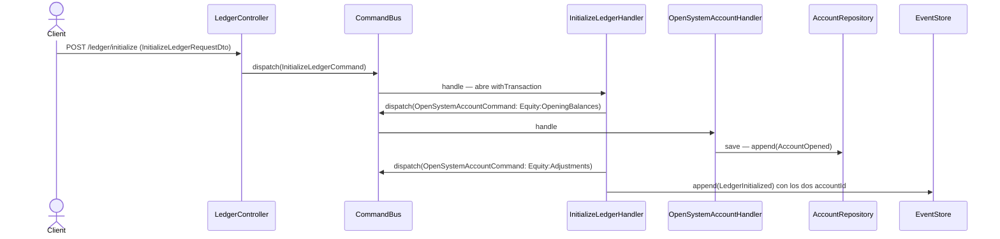

# Inicializar ledger

Punto de entrada obligatorio del ledger de un usuario: fija la moneda de presentación y la
timezone, y crea las cuentas técnicas de sistema (`Equity:OpeningBalances`,
`Equity:Adjustments`) que el resto de los flujos asume existentes.

Lo sirve `LedgerController` —no `AccountsController`— porque es ciclo de vida a nivel
ledger, no de una cuenta. Vive bajo el módulo `accounts` por cercanía: el efecto observable
de inicializar es la aparición de las cuentas de sistema.

Las cuentas entran por el `CommandBus` como `OpenSystemAccountCommand`: el agregado
`Account` pertenece a este módulo y no se construye desde otro. Los tres appends comparten
un único `withTransaction` (INV-7) y el dispatch de proyecciones queda fuera del scope.

## Qué cambió en `refactor-module-boundaries`

El comportamiento observable es idéntico: mismo endpoint, mismo request, misma respuesta,
mismos errores. Lo que cambia es **quién crea las cuentas técnicas**.

Antes, `InitializeLedgerHandler` construía el agregado `Account` y lo persistía con
`AccountRepository` — ambos del módulo `accounts`, alcanzados desde el módulo `ledger`. Eso
significaba que una regla nueva en la apertura de cuentas (una validación de nombre, un
evento adicional, un campo obligatorio) no llegaba a las cuentas de sistema, y nada fallaba:
el compilador aceptaba la llamada vieja.

Ahora las dos cuentas entran por `OpenSystemAccountCommand`, despachado por el `CommandBus`
dentro del mismo `withTransaction`. Es la misma ruta que ya usa
[`record-opening-balance`](./record-opening-balance.md) para cruzar a `transactions`.

Lo que **no** cambió, y los tests deben seguir probándolo:

- **INV-7** — los tres appends (dos cuentas + settings) siguen en una única transacción del
  event store. Un fallo a mitad no deja cuentas técnicas huérfanas ni settings apuntando a
  cuentas inexistentes.
- El **dispatch de proyecciones sigue fuera** del scope transaccional: un projector que falla
  no revierte hechos contables ya confirmados. Por eso `OpenSystemAccountHandler` no despacha
  proyecciones — lo hace el caller, una sola vez, con los eventos de los tres appends.
- **INV-13** — las cuentas nacen con `isSystem: true` y quedan protegidas: no se renombran ni
  se cierran (`SYSTEM_ACCOUNT_PROTECTED`).

## Reglas

- **AC-1:** `{ presentationCurrency, timezone }` (+ `external_ref` opcional) despacha
  `InitializeLedgerCommand` y responde `201` con `CommandAcceptedDto`, incluyendo
  `streamPosition` en body y header `X-Ledger-Stream-Position`.
- **RNF-10:** el controller solo mapea forma → command. Las cuentas de sistema las crea el
  agregado, no el adaptador.
- Las cuentas de sistema quedan protegidas por INV-13: no se pueden renombrar ni cerrar
  (`SYSTEM_ACCOUNT_PROTECTED`).
- El `AuthContext` con el que se abren las cuentas técnicas lleva `externalRef: null`
  (anchor-only stamping): el stream de settings es el ancla de idempotencia, no el de cuentas.
- **Idempotencia:** reenviar con el mismo `external_ref` replaya el resultado original con
  `200` — ver [`../../shared/flows/idempotent-write.md`](../../shared/flows/idempotent-write.md).

## Errores

| Condición | Excepción | code | HTTP |
|---|---|---|---|
| El ledger del usuario ya fue inicializado | `LedgerAlreadyInitializedException` | `LEDGER_ALREADY_INITIALIZED` | 409 |
| Código de moneda inutilizable (blank/formato) | `InvalidCurrencyCodeException` | `INVALID_CURRENCY_CODE` | 422 |
| Timezone IANA inválida | `InvalidTimeZoneException` | `INVALID_TIME_ZONE` | 422 |
| Sin contexto autenticado | `UnauthorizedException` (`LedgerContextGuard`) | — | 401 |

## Respuesta

`201`: `CommandAcceptedDto { id, streamPosition }` + header `X-Ledger-Stream-Position`.
`200` si es un replay idempotente.
