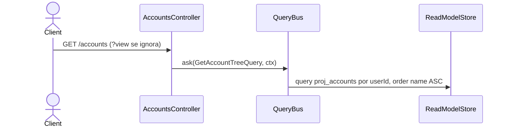

# Listar cuentas (lista plana)

`GetAccountTreeHandler` devuelve las cuentas del usuario desde `proj_accounts`, ordenadas
alfabéticamente por nombre. El `userId` del contexto se aplica siempre (INV-9).

**`?view=tree|flat` se acepta y se ignora.** `AccountTreeQueryDto` valida el parámetro,
pero el controller lo recibe como `_query` y nunca lo transporta al query bus: la respuesta
es **siempre plana**. El shaping jerárquico está pendiente — ver el `TODO(read-shape)` en
`account-tree-view.ts`. El cliente puede reconstruir la jerarquía desde el nombre
(`Assets:Bancolombia:Savings`), que codifica la ruta completa.

El parámetro `?view=tree|flat` se valida pero se ignora: la respuesta es siempre la lista
plana ordenada por nombre (hu-0013, AC-4).

## Reglas

- **AC-7:** Devuelve todas las cuentas del usuario desde `account_tree` (proyección
  construida por `AccountTreeProjector` en `hu-0004`). El orden es `name ASC`.
- **AC-8 (INV-9):** `user_id` del contexto filtra estrictamente — un usuario solo ve
  sus propias cuentas.
- **RNF-10:** Solo lectura — el handler no escribe ni accede al `EventStore`.

## Errores

| Condición | Excepción | HTTP |
|---|---|---|
| Query type sin handler registrado | `UnregisteredQueryException` | Depende del controller |

## Respuesta

`200`: `AccountRow[]` — lista plana de cuentas con `account_id`, `name`, `type`,
`parent_id`, `currency_code`, `opened_on`, `closed_on`, etc. Ordenadas por `name ASC`.
