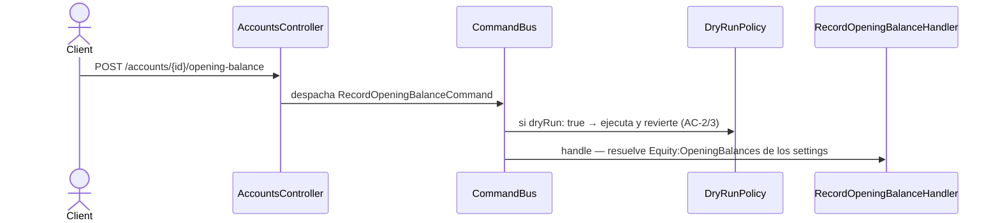

# Registrar saldo inicial

Asienta el saldo de apertura de una cuenta contra `Equity:OpeningBalances`, la cuenta
técnica que `initialize-ledger` creó. Es el punto de entrada para cargar un ledger con
saldos preexistentes sin inventar una transacción de negocio.

`AccountsController` construye el `RecordOpeningBalanceCommand` desde el body
(`amount`, `currency`, `date`, `dryRun`) y lo despacha al `CommandBus`. El handler
resuelve `Equity:OpeningBalances` desde los settings del ledger (INV-13) — no lo recibe
por parámetro.

> Este flow se creó en spec-0033. El caso de uso existía desde hu-0025 con su handler y su
> DTO, pero solo estaba documentado como `dynamic view` en el modelo LikeC4, sin doc propia.

## Reglas

- **La contrapartida no se elige.** El handler la resuelve desde los settings del ledger:
  siempre es `Equity:OpeningBalances` (INV-13).
- **`dryRun: true` ejecuta completo y revierte.** Devuelve el `CommandResult` que la
  ejecución real habría producido, sin que nada llegue al stream. Ver
  [`../../shared/flows/dry-run-preview.md`](../../shared/flows/dry-run-preview.md).
- **Los appends comparten transacción** (INV-7): el asiento y su contrapartida se
  persisten juntos o no se persisten.
- **Reintento ante fallos transitorios.** `RetryPolicy` reintenta `40P01`/`40001`; al
  agotarse responde `PERSISTENCE_CONFLICT`. Ver
  [`../../shared/flows/retry-transient-failure.md`](../../shared/flows/retry-transient-failure.md).

## Errores

| Condición | Excepción | code | HTTP |
|---|---|---|---|
| Cuenta inexistente para el usuario | `AccountNotFoundException` | `ACCOUNT_NOT_FOUND` | 404 |
| Cuenta cerrada | `AccountClosedException` | `ACCOUNT_CLOSED` | 409 |
| Moneda no admitida por la cuenta | `CurrencyNotAllowedException` | `CURRENCY_NOT_ALLOWED` | 422 |
| Reintentos transitorios agotados | `PersistenceConflictException` | `PERSISTENCE_CONFLICT` | 409 |

## Respuesta

`201 Created` con `CommandAcceptedDto { id, streamPosition }` y el header
`X-Ledger-Stream-Position`. Con `dryRun: true`, el mismo cuerpo como preview del
resultado real ya revertido.
