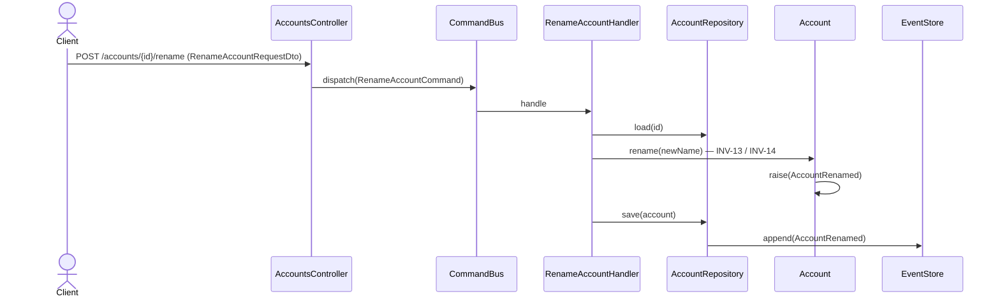

# Renombrar cuenta

Cambia el nombre de una cuenta existente. Es una transición de ciclo de vida
event-sourced (por eso `POST /{id}/rename` y no `PATCH`). El `RenameAccountHandler`
rehidrata el agregado, aplica `rename(newName)` y persiste `AccountRenamed`.

## Reglas

- **INV-13:** las cuentas de sistema están protegidas; renombrarlas se rechaza.
- **INV-14:** el tipo raíz es inmutable — el renombre no puede alterar la naturaleza
  de la cuenta.

## Errores

| Condición | Excepción | HTTP |
|---|---|---|
| Cuenta de sistema | `SystemAccountProtectedException` | 409 |
| Alteración de tipo raíz | `RootTypeImmutableException` | 409 |
| Cuenta inexistente | `AccountNotFoundException` | 404 |

## Respuesta

`200 OK` con `CommandAcceptedDto`.
