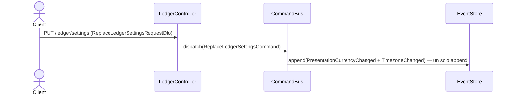

# Reemplazar la configuración del ledger

Deja la moneda de presentación y la zona horaria en los valores enviados. Es un `PUT`: el
cuerpo describe la configuración resultante, no un delta, así que ambos campos son
obligatorios.

La zona horaria no es una preferencia cosmética. RNF-7 la define como el parámetro del que
se deriva el cierre del día, y de ahí depende la semántica temporal de las afirmaciones de
saldo (§2.4): cambiarla cambia contra qué corte se evalúan las conciliaciones futuras. La
moneda de presentación, en cambio, no altera ningún monto ya registrado — es un parámetro
de lectura (§2.7, principio de diseño #5).

## Reglas

- **Atomicidad (§3.5):** los dos cambios ocurren sobre el mismo agregado `LedgerSettings`,
  cuya raíz es el `user_id`, y se persisten con un único `save`. Los dos eventos comparten
  un append: no existe un estado donde la moneda cambió y el huso no.
- **Un solo command:** `ReplaceLedgerSettingsCommand`. Despachar dos commands desde el
  controller sí habría roto la atomicidad; orquestar dos métodos del mismo agregado, no.
- **Idempotencia del dominio:** el agregado no emite evento si el valor no cambia. Un `PUT`
  con la configuración actual responde `200` sin agregar nada al stream.
- **Idempotencia del command (RF-11):** el `X-External-Ref` evita que un reintento duplique
  el cambio.
- **El ledger debe estar inicializado:** de lo contrario `LEDGER_NOT_INITIALIZED`, el mismo
  código estable que reporta `reconciliation` para esta condición.
- **Efecto en la conciliación (RNF-7):** el proyector actualiza `proj_ledger_settings`, que
  es de donde `LedgerSettingsReader` toma el huso para `IntlDayBoundaryResolver`. La
  siguiente evaluación de aserciones usa el valor nuevo.

## Errores

| Condición | Excepción | HTTP |
|---|---|---|
| El ledger no está inicializado | `LedgerNotInitializedException` | 422 |
| Moneda fuera de ISO-4217 | validación del DTO / `CurrencyCode` | 400 |
| Zona horaria IANA inválida | `IanaTimeZone` | 400 |
| Sin contexto autenticado | — (guard, RF-26) | 401 |

## Respuesta

`200 OK` con `CommandAcceptedDto` y el header `X-Ledger-Stream-Position`, que permite leer
la escritura propia inmediatamente con `GET /v1/ledger/settings` (RNF-9).
