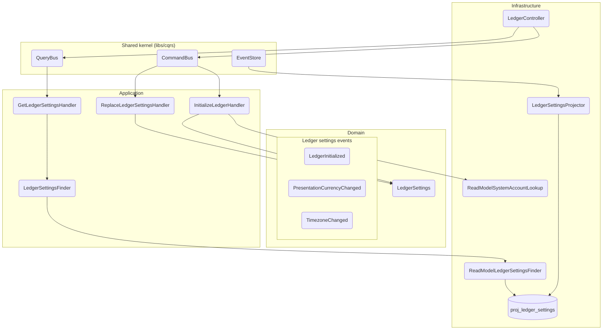

# Módulo: ledger (apps/ledger)

> C4 Nivel 3 · documentación viva. El diagrama de componentes vive acá; cada flujo lleva
> su diagrama de secuencia inline en [`flows/`](./flows/). Este README es el arc42-lite
> del módulo: propósito, invariantes y lenguaje ubicuo.

## Propósito

Gestiona el ciclo de vida a nivel ledger: inicialización (crea las cuentas técnicas de
sistema `Equity:OpeningBalances` y `Equity:Adjustments`), lectura y reemplazo de settings
(moneda de presentación, timezone). Es un módulo event-sourced: cada transición de estado
emite un evento de dominio persistido en el `EventStore`.

## Diagramas

**Componentes (C4 Nivel 3).** Los nodos nombran la clase real; el gate de CI
(`npm run docs:validate`) falla si alguno deja de existir.

## Casos de uso (flujos)

| Flujo | Trigger | Endpoint | Command |
|---|---|---|---|
| [`initialize-ledger`](./flows/initialize-ledger.md) | rest | `POST /ledger/initialize` | `InitializeLedgerCommand` |
| [`get-ledger-settings`](./flows/get-ledger-settings.md) | rest | `GET /ledger/settings` | `GetLedgerSettingsQuery` |
| [`replace-ledger-settings`](./flows/replace-ledger-settings.md) | rest | `PUT /ledger/settings` | `ReplaceLedgerSettingsCommand` |
