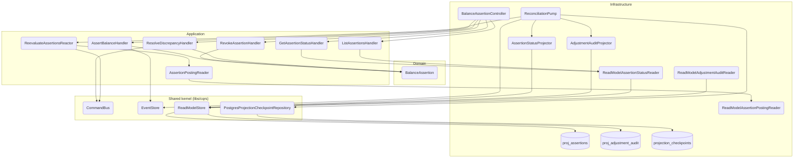

# Módulo: reconciliation (apps/ledger)

> C4 Nivel 3 · documentación viva. El diagrama de componentes vive acá; cada flujo lleva
> su diagrama de secuencia inline en [`flows/`](./flows/). Este README es el arc42-lite
> del módulo.

## Propósito

Concilia el ledger contra la verdad externa: el extracto bancario. El usuario afirma cuánto
debería haber en una cuenta a una fecha (`BalanceAssertion`), el sistema evalúa esa
afirmación contra el saldo proyectado, y cuando hay discrepancia real la resuelve con un
ajuste contable contra `Equity:Adjustments`.

Es núcleo contable, no producto: el principio de diseño #6 de la especificación —*"el
extracto bancario es la verdad externa"*— se materializa acá, y Beancount trata `balance`
como directiva de primera clase por la misma razón.

## Diagramas

**Componentes (C4 Nivel 3).** Los nodos nombran la clase real; el gate de CI
(`npm run docs:validate`) falla si alguno deja de existir.

- **Flujos:** ver [`flows/`](./flows/) — cada uno lleva su `sequenceDiagram` inline.
- **Contrato REST:** [`api.yaml`](./api.yaml) (OpenAPI 3.1, documento vivo).

## Casos de uso (flujos)

| Caso de uso | Trigger | Entrypoint | Doc |
|---|---|---|---|
| Afirmar un saldo | rest | `POST /v1/balance-assertions` | [assert-balance](./flows/assert-balance.md) |
| Revocar una aserción | rest | `POST /v1/balance-assertions/{id}/revoke` | [revoke-assertion](./flows/revoke-assertion.md) |
| Resolver una discrepancia | rest | `POST /v1/balance-assertions/{id}/resolve` | [resolve-discrepancy](./flows/resolve-discrepancy.md) |
| Consultar una aserción | rest | `GET /v1/balance-assertions/{id}` | [get-assertion-status](./flows/get-assertion-status.md) |
| Listar aserciones de una cuenta | rest | `GET /v1/balance-assertions` | [list-assertions](./flows/list-assertions.md) |
| **Proyectar assertion_status** | **domain-event** | `BalanceAsserted`/`Evaluated`/`Revoked`/`DiscrepancyResolved` | [project-assertion-status](./flows/project-assertion-status.md) |
| **Proyectar adjustment_audit** | **domain-event** | `DiscrepancyResolved` | [project-adjustment-audit](./flows/project-adjustment-audit.md) |
| **Bombear el stream** | **cron** | `ReconciliationPump.pump()` | [run-reconciliation-pump](./flows/run-reconciliation-pump.md) |
| **Re-evaluar aserciones afectadas** | **domain-event** | `TransactionRecorded`/`Amended`/`Voided` | [reevaluate-assertions](./flows/reevaluate-assertions.md) |

> Contrato REST completo (schemas, códigos de error, respuestas): [`api.yaml`](./api.yaml).

## Invariantes y reglas

- **Semántica temporal (§2.4):** una aserción se evalúa contra el saldo al cierre del día en
  la zona horaria de `LedgerSettings`. Cuando conviven transacciones con y sin `occurred_at`
  y no se puede decidir el orden intradía, el veredicto es `INDETERMINATE`, nunca un falso
  `MISMATCHED`.
- **Re-evaluación automática (RF-18):** un evento que altera postings anteriores a la fecha
  de corte de una aserción la vuelve a evaluar. Una aserción `MATCHED` puede pasar a
  `MISMATCHED` si después se anula una transacción anterior a ella. Disparan
  `TransactionRecorded`, `TransactionAmended` y `TransactionVoided`; **no** `Confirmed`
  (no altera el monto evaluado) ni `Reversed` (la reversa emite su propio `Recorded`).
- **Las aserciones revocadas son terminales:** no se re-evalúan ni vuelven a estado activo,
  ni siquiera tras un rebuild completo.
- **La resolución es contable, no un parche:** `ResolveDiscrepancy` registra una transacción
  de sistema contra `Equity:Adjustments`. El dinero sin explicación queda auditado por
  cuenta, no escondido.
- **Un único escritor por read model (RNF-10, Artículo 10):** los projectors son los únicos
  que escriben `proj_assertions` y `proj_adjustment_audit(_entries)`; el reactor solo
  despacha commands.

## Lenguaje ubicuo

| Término | Significado |
|---|---|
| **Assertion** | Afirmación de que una cuenta tenía cierto saldo a cierta fecha. Es un checkpoint de conciliación, no un asiento. |
| **Verdict** | Resultado de evaluar una aserción: `UNCHECKED`, `MATCHED`, `MISMATCHED`, `INDETERMINATE` o `REVOKED`. |
| **Difference** | Cuánto se aparta el saldo real del afirmado. Es el monto que un ajuste tendría que mover. |
| **Tolerance** | Margen dentro del cual una diferencia no cuenta como discrepancia. |
| **Discrepancy** | Una aserción `MISMATCHED` cuya diferencia se considera real y hay que explicar. |
| **Adjustment** | Transacción de sistema contra `Equity:Adjustments` que cierra una discrepancia. |
| **Unexplained money** | El acumulado de ajustes por cuenta: cuánto dinero no tiene origen documentado. |

## Persistencia

Las dos proyecciones se sirven del `ReadModelStore` compartido, como el resto del read side,
y se reconstruyen por replay (RNF-5) con `nx run ledger:rebuild --projection reconciliation`.
Ambas se registran bajo **una sola** entrada del `ProjectionRegistry`, porque
`AdjustmentAuditProjector` lee `proj_assertions`: reconstruirlas por separado produciría una
auditoría calculada contra un estado arbitrario.

`ReconciliationPump` las alimenta desde el stream global con un checkpoint persistido en
`projection_checkpoints`, y recién después alimenta al reactor — ese orden es lo que
garantiza que la re-evaluación consulte un `assertion_status` al día.
