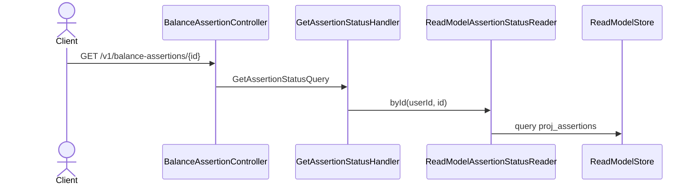

# Consultar el estado de una aserción

Devuelve la aserción con su veredicto actual, leída de `proj_assertions`. Es el camino por el
que un cliente se entera del resultado de una evaluación, que ocurre de forma asíncrona
después de declarar la aserción.

Query pura (RNF-10, Artículo 10): no toca el event store ni ejecuta lógica de dominio, solo
lee la proyección a través de `AssertionStatusStore`.

## Reglas

- **Artículo 5:** una aserción de otro usuario responde `404`, no `403` — el ledger no
  revela la existencia de recursos ajenos.
- `status` refleja el último veredicto: `UNCHECKED` mientras no se evaluó, `INDETERMINATE`
  cuando el orden intradía no se puede decidir (§2.4), `REVOKED` si se revocó.
- `difference` es `null` hasta la primera evaluación.
- `resolvedByTxn` apunta al ajuste que cerró la discrepancia, si hubo.

## Errores

| Condición | Excepción | HTTP |
|---|---|---|
| No existe para este usuario | `AssertionNotFoundException` | 404 |
| Sin contexto autenticado | — (guard, RF-26) | 401 |

## Respuesta

`200 OK` con `AssertionStatus`.
