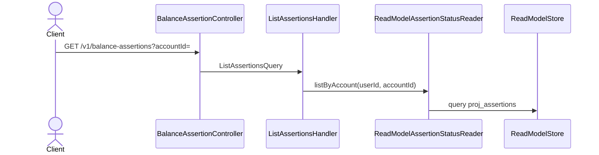

# Listar las aserciones de una cuenta

Devuelve el historial de conciliación de una cuenta: todas sus aserciones con su veredicto,
incluidas las revocadas. Sirve la vista de «cómo viene conciliando esta cuenta» del frontend.

Query pura sobre `proj_assertions`, acotada por `user_id` y `account_id`.

## Reglas

- **Artículo 5:** solo devuelve aserciones del usuario del contexto.
- **Incluye las revocadas:** son parte del historial auditable y el cliente decide si las
  muestra. El filtro de revocadas de la re-evaluación es otro camino
  (`nonRevokedOnAccountFrom`) y no aplica acá.
- `accountId` es obligatorio: no hay listado global de aserciones. Conciliar es siempre
  contra una cuenta concreta.

## Errores

| Condición | Excepción | HTTP |
|---|---|---|
| Sin contexto autenticado | — (guard, RF-26) | 401 |

## Respuesta

`200 OK` con un array de `AssertionStatus`, vacío si la cuenta no tiene aserciones.
