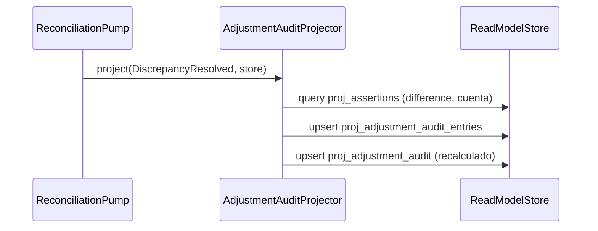

# Proyectar `adjustment_audit`

`AdjustmentAuditProjector` mantiene el indicador de «dinero sin explicación» por cuenta:
cuánto se ajustó contra `Equity:Adjustments` para cerrar discrepancias de conciliación.
Reacciona sólo a `DiscrepancyResolved` y escribe dos tablas — el detalle por ajuste
(`proj_adjustment_audit_entries`) y el acumulado por cuenta+moneda
(`proj_adjustment_audit`).

El monto del ajuste no viaja en el payload de `DiscrepancyResolved`: es la `difference` que
`BalanceAssertionEvaluated` dejó en la fila de la aserción. Por eso el projector **lee**
`proj_assertions` antes de escribir, lo que crea una dependencia de orden entre las dos
proyecciones. Ambas se registran como una sola entrada del `ProjectionRegistry`
(`reconciliation`) para compartir checkpoint y garantizar ese orden también durante un
rebuild.

## Reglas

- **AC-0:** extiende `Projector`, con `name = 'adjustment_audit'` y
  `consumes = [DiscrepancyResolved]`.
- **AC-1:** lee la aserción con `store.query(PROJ_ASSERTIONS, criteria)` y escribe con
  `store.upsert(...)` — un único puerto para leer y escribir read models.
- **Guarda:** si la aserción no existe o su `difference` es nula, el evento se ignora sin
  error. Una discrepancia sin diferencia conocida no tiene monto que auditar.
- **Idempotencia por `adjustment_txn_id` (RNF-4):** el detalle se upserta por esa clave, así
  que reprocesar el mismo `DiscrepancyResolved` no vuelve a sumar al acumulado.
- **El acumulado se recalcula, no se incrementa.** `total_adjusted` y `adjustment_count`
  se derivan agregando las entradas de detalle de esa cuenta+moneda, no sumando sobre el
  valor previo. Un `UPDATE … SET total = total + x` no sería idempotente ante replay y
  rompería AC-8.

## Errores

| Condición | Excepción | HTTP |
|---|---|---|
| Aserción referenciada inexistente o sin `difference` | — (guarda, no es error) | — |
| Fallo de escritura en el read model | propaga la del adaptador | — (el pump detiene el checkpoint) |

## Respuesta

Sin respuesta HTTP — el efecto observable es el acumulado por cuenta en
`proj_adjustment_audit`, con una fila de detalle por ajuste en
`proj_adjustment_audit_entries`.
