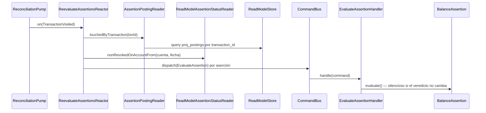

# Re-evaluar aserciones afectadas

Cuando un evento altera los postings de una cuenta en una fecha anterior al corte de una
aserción, esa aserción deja de ser confiable: un `MATCHED` puede haber pasado a
`MISMATCHED` sin que nadie lo note. `ReevaluateAssertionsReactor` cierra ese hueco
despachando `EvaluateAssertion` sobre cada aserción afectada (RF-18).

El reactor es un process manager: escucha eventos y despacha commands, nunca escribe
eventos ni proyecciones (§3.2, RNF-10, Artículo 10). Lo ejecuta `ReconciliationPump`
después de proyectar cada evento, de modo que el lookup siempre lee un `assertion_status`
al día.

## Reglas

- **Disparadores (AC-1):** `TransactionRecorded`, `TransactionAmended` y — nuevo en esta
  historia — `TransactionVoided`.
- **De dónde salen las cuentas tocadas (AC-3):** `Recorded` y `Amended` llevan `postings` y
  `date` en el payload y se leen de ahí. `Voided` lleva solo `{ reason }`, así que el
  reactor consulta `proj_postings` por `transaction_id` a través de
  `AssertionPostingReader`. No hay lag: `proj_postings` se escribe de forma síncrona en la
  transacción del command (§8.1).
- **Alcance temporal:** solo se re-evalúan las aserciones de la cuenta cuyo corte es igual
  o posterior a la fecha contable de la transacción. Una aserción anterior no puede verse
  afectada por un movimiento posterior a ella.
- **Revocadas nunca (AC-5):** el filtro vive en
  `AssertionStatusStore.nonRevokedOnAccountFrom`, así que todo disparador lo hereda.
- **Idempotencia (AC-4):** el agregado `BalanceAssertion` permanece en silencio si el
  veredicto no cambia, de modo que reprocesar un evento no agrega eventos al stream.

## Por qué `Confirmed` y `Reversed` no disparan (AC-2)

- `AssertionPostingReader` devuelve `CONFIRMED` **y** `PENDING`, y nunca `VOIDED`;
  `AssertionEvaluator` suma sin discriminar por estado.
- **`TransactionConfirmed`** deja el monto igual: el posting ya contaba como pendiente.
- **`TransactionReversed`** ya está cubierto — la reversa emite su propio
  `TransactionRecorded`, con postings y fecha, que este mismo flujo procesa.

Ambos casos tienen test propio, para que la afirmación no dependa de la memoria de quien
lea el código.

## Errores

| Condición | Excepción | HTTP |
|---|---|---|
| La transacción anulada no tiene postings en `proj_postings` | — (guarda, no hay nada que re-evaluar) | — |
| Falla `EvaluateAssertion` | propaga; el pump loguea la posición y no avanza el checkpoint | — |

## Respuesta

Sin respuesta HTTP. El efecto observable es el veredicto actualizado en `proj_assertions`,
legible por `GET /v1/balance-assertions/{id}`.
