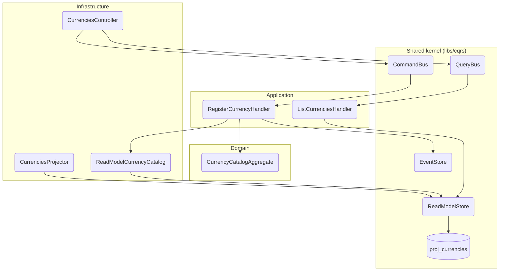

# Módulo: reference (apps/ledger)

> C4 Nivel 3 · documentación viva. El diagrama de componentes vive acá; cada flujo lleva
> su diagrama de secuencia inline en [`flows/`](./flows/). Este README es el arc42-lite
> del módulo.

## Propósito

Mantiene el catálogo de monedas: qué códigos existen y con cuántos decimales opera cada uno.
Es lo que `Money` consulta para saber que COP no admite centavos y USD sí (INV-8, RNF-2).

Antes de este módulo el catálogo era un mapa constante en el código: agregar una moneda
exigía recompilar y deployar.

## Diagramas

**Componentes (C4 Nivel 3).** Los nodos nombran la clase real; el gate de CI
(`npm run docs:validate`) falla si alguno deja de existir.

**Flujos:** ver [`flows/`](./flows/) — cada uno lleva su `sequenceDiagram` inline.

## Casos de uso (flujos)

| Caso de uso | Trigger | Entrypoint | Doc |
|---|---|---|---|
| Registrar una moneda | rest | `POST /v1/currencies` | [register-currency](./flows/register-currency.md) |
| Listar monedas | rest | `GET /v1/currencies` | [list-currencies](./flows/list-currencies.md) |

## La restricción que gobierna el diseño

**`CurrencyCatalog.resolve(code)` es síncrono, y no puede dejar de serlo.**

Lo consumen 22 archivos, y no solo desde handlers: se llama dentro de `fromPayload` de todo
evento que lleva montos — `TransactionRecorded`, `BalanceAsserted` y compañía. Es decir, en
la **deserialización del stream**. Volverlo asíncrono rompería la rehidratación de cualquier
agregado con dinero.

De ahí el diseño: `ReadModelCurrencyCatalog` lee `proj_currencies` pero sirve desde una
caché en memoria, hidratada al arrancar y refrescada tras cada registro.

## Invariantes y reglas

- **El catálogo es global.** Una moneda es dato de referencia universal, no dato de negocio
  de un usuario. Es la única proyección del ledger sin `user_id`, y una excepción declarada
  al Artículo 5.
- **Su stream usa un `userId` de sistema reservado.** `StreamId` exige uno y el event store
  filtra por él (INV-9); un stream global se estampa con un UUID constante en vez de fingir
  que pertenece a alguien.
- **`minorUnits` entre 0 y 4**, el rango de ISO-4217: 0 para COP o JPY, 2 para USD o EUR,
  4 para CLF y UYW.
- **La precisión de una moneda no cambia jamás.** Re-registrar con la misma precisión es un
  no-op idempotente; con otra distinta se rechaza. Cambiarla reinterpretaría todo monto ya
  registrado —`100` pasaría de valer 100 a valer 1,00— y eso viola el principio de diseño
  #5.
- **COP y USD siempre resuelven**, incluso con la proyección vacía. Viven en el adaptador y
  no en una migración: `rebuild currencies` trunca la tabla y la reconstruye desde el
  stream, así que filas sembradas por migración desaparecerían en el primer rebuild.
- **Un fallo al hidratar no impide arrancar.** Se loguea y se sigue con el conjunto base:
  negarse a arrancar por datos de referencia sería peor que operar en COP y USD.

## Lenguaje ubicuo

| Término | Significado |
|---|---|
| **Currency** | Código ISO-4217 más su precisión decimal. No es un monto. |
| **Minor units** | Cuántos decimales admite la moneda. Gobierna el redondeo de `Money`. |
| **Reference data** | Dato universal que el ledger consume pero no produce como hecho económico. |
