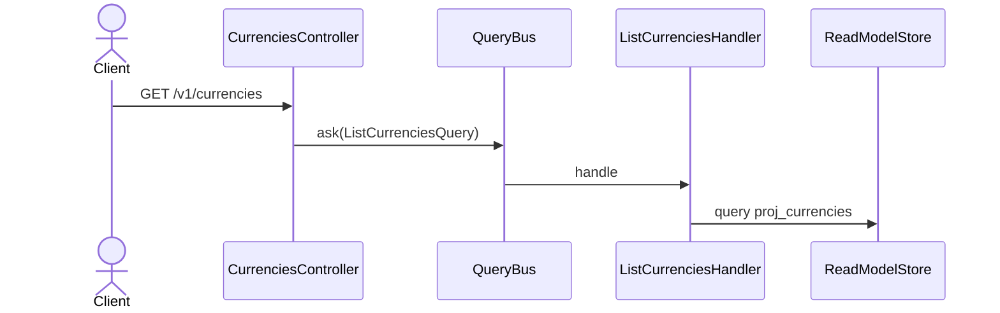

# Listar las monedas registradas

Devuelve el catálogo con su precisión decimal, ordenado por código. Sirve al frontend para
poblar el selector de moneda al abrir una cuenta o registrar una transacción.

Query pura sobre `proj_currencies` (RNF-10, Artículo 10). **No filtra por usuario**: el
catálogo es global, y es la única consulta del ledger que no se acota por `user_id`.

## Reglas

- Devuelve lo que hay en la proyección. Las monedas base del adaptador (COP, USD) aparecen
  acá solo si además fueron registradas por evento — el listado refleja el catálogo
  administrado, no el conjunto que `resolve` puede servir.
- Exige contexto autenticado (RF-26) aunque no lo use para filtrar: ningún endpoint del
  ledger es anónimo.

## Errores

| Condición | Excepción | HTTP |
|---|---|---|
| Sin contexto autenticado | — (guard, RF-26) | 401 |

## Respuesta

`200 OK` con un array de `{ code, minorUnits, name }`, vacío si nadie registró monedas.
