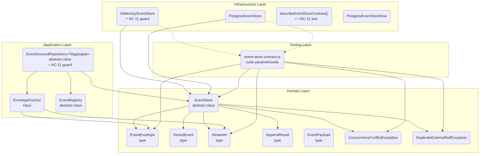

# Componentes: shared-kernel (apps/ledger)

> C4 Nivel 3 — building blocks internos del módulo `shared-kernel`.
> Diagrama acumulativo: incluye componentes de `hu-0001` + lo nuevo/modificado de `hu-0002`.

### Componentes modificados por hu-0002

| Componente | Capa | Cambio |
|---|---|---|
| `EventSourcedRepository.save()` | Application | Agrega early return si `pullChanges()` está vacío (AC-11) |
| `InMemoryEventStore.append()` | Infrastructure | Agrega guard para `events: []` → no-op (AC-11) |
| `describeEventStoreContract()` | Testing | Agrega un test case: `append` con lote vacío es no-op (AC-11) |

### Componentes existentes (sin cambios)

- `EventStore` (puerto, `domain/ports/event-store.ts`) — 4 operaciones, sin modificar.
- `EventEnvelope`, `StoredEvent`, `StreamId`, `AppendResult`, `EventPayload` (tipos, `domain/event/`) — sin cambios.
- `ConcurrencyConflictException`, `DuplicateExternalRefException` (`domain/exceptions/event-store.exception.ts`) — sin cambios.
- `EnvelopeFactory`, `EventRegistry` (`application/event/`) — sin cambios.
- `PostgresEventStore` (`infrastructure/adapters/event-store/postgres/`) — sin cambios.
