# Componentes: shared-kernel — subsistema de command bus (apps/ledger)

> C4 Nivel 3 — building blocks internos del módulo `shared-kernel`.
> Diagrama acumulativo: incluye componentes de `hu-0001` (event store), `hu-0002` (repository +
> contract tests), `hu-0004` (subsistema de proyecciones), y `hu-0005` (subsistema de command bus:
> políticas transversales + handlers núcleo).

```mermaid
graph TD
  subgraph domain["Domain Layer"]
    EV("EventEnvelope<br/>type")
    SE("StoredEvent<br/>type")
    SID("StreamId<br/>type")
    AR("AppendResult<br/>type")
    EP("EventPayload<br/>type")
    ES_PORT("EventStore<br/>abstract class")
    AE("AggregateRoot&lt;T&gt;<br/>abstract class")
    DE("DomainEvent<br/>type")
    CCE("ConcurrencyConflictException")
    DRE("DuplicateExternalRefException")
  end

  subgraph application["Application Layer"]
    %% Repository subsystem
    ESR("EventSourcedRepository&lt;TAggregate&gt;<br/>abstract class")
    EF("EnvelopeFactory<br/>class")
    ER("EventRegistry<br/>abstract class")

    %% Projection subsystem
    RMS_PORT("ReadModelStore<br/>abstract class")
    PROJ("Projector<br/>abstract class")
    PD_PORT("ProjectionDispatcher<br/>abstract class")
    CPR_PORT("ProjectionCheckpointRepository<br/>abstract class")

    %% Command bus subsystem (hu-0005) ⚡
    CMD("Command<br/>abstract class<br/>⚡ hu-0005")
    CMD_H("CommandHandler&lt;T&gt;<br/>abstract class<br/>⚡ hu-0005")
    CMD_BUS("CommandBus<br/>abstract class<br/>⚡ hu-0005")
    PCB("PolicyCommandBus<br/>class<br/>⚡ hu-0005")
    CP("CommandPolicy<br/>abstract class<br/>⚡ hu-0005")
    CN("CommandNext<br/>type<br/>⚡ hu-0005")
    ACMD_RESULT("CommandResult<br/>type<br/>⚡ hu-0005")
    AUTH_CTX("AuthContext<br/>type<br/>⚡ hu-0005")
    UNREG("UnregisteredCommandException<br/>⚡ hu-0005")

    %% Policies ⚡
    ACP("AuthenticatedContextPolicy<br/>⚡ hu-0005")
    IDP("IdempotencyPolicy<br/>⚡ hu-0005")
    OCP("OptimisticConcurrencyPolicy<br/>⚡ hu-0005")
    MAC("MissingAuthContextException<br/>⚡ hu-0005")
  end

  subgraph infrastructure["Infrastructure Layer"]
    IMES("InMemoryEventStore")
    PES("PostgresEventStore")
    SYNC("SynchronousProjectionDispatcher")
    POLL("PollingProjectionDispatcher")
    IM_RMS("InMemoryReadModelStore")
    PG_RMS("PostgresReadModelStore")
    REB("ProjectionRebuilder")
  end

  subgraph testing["Testing Layer"]
    ES_CONTRACT("describeEventStoreContract()<br/>suite parametrizada")
    RMS_CONTRACT("describeReadModelStoreContract()<br/>suite parametrizada")
  end

  %% Command bus wiring (hu-0005)
  CMD_BUS --> CMD
  CMD_BUS --> AUTH_CTX
  CMD_BUS --> ACMD_RESULT
  CMD_H --> CMD
  CMD_H --> AUTH_CTX
  CMD_H --> ACMD_RESULT
  CP --> CMD
  CP --> AUTH_CTX
  CP --> ACMD_RESULT
  CP --> CN
  PCB --> CMD_BUS
  PCB --> CP
  PCB --> CMD_H
  ACP --> CP
  IDP --> CP
  IDP --> ES_PORT
  OCP --> CP
  OCP --> CCE

  %% Event Store wiring (existing)
  ES_PORT --> EV
  ES_PORT --> SE
  ES_PORT --> SID
  ES_PORT --> AR
  ES_PORT --> CCE
  ES_PORT --> DRE
  IMES --> ES_PORT
  PES --> ES_PORT

  %% Repository wiring
  ESR --> ES_PORT
  ESR --> EF
  ESR --> ER

  %% Projection wiring
  PROJ --> SE
  PROJ --> RMS_PORT
  PD_PORT --> SE
  SYNC --> PD_PORT
  SYNC --> PROJ
  SYNC --> RMS_PORT
  POLL --> PD_PORT
  POLL --> PROJ
  POLL --> RMS_PORT
  POLL --> ES_PORT
  POLL --> CPR_PORT
  REB --> ES_PORT
  REB --> RMS_PORT
  IM_RMS --> RMS_PORT
  PG_RMS --> RMS_PORT

  %% Testing
  ES_CONTRACT --> ES_PORT
  IMES -.-> ES_CONTRACT
  PES -.-> ES_CONTRACT
  RMS_CONTRACT --> RMS_PORT
  IM_RMS -.-> RMS_CONTRACT
  PG_RMS -.-> RMS_CONTRACT
```

## Componentes nuevos en hu-0005

| Capa | Componente | Archivo |
|------|-----------|---------|
| Application | `Command` (abstract) | `shared-kernel/application/command-bus/command.ts` |
| Application | `CommandHandler<TCommand>` (abstract) | `shared-kernel/application/command-bus/command-handler.ts` |
| Application | `CommandBus` (abstract) | `shared-kernel/application/command-bus/command-bus.ts` |
| Application | `PolicyCommandBus` (class) | `shared-kernel/application/command-bus/command-bus.ts` |
| Application | `CommandPolicy` (abstract) | `shared-kernel/application/command-bus/command-policy.ts` |
| Application | `CommandNext` (type) | `shared-kernel/application/command-bus/command-policy.ts` |
| Application | `CommandResult` (type) | `shared-kernel/application/command-bus/command-result.type.ts` |
| Application | `AuthContext` (type) | `shared-kernel/application/command-bus/auth-context.type.ts` |
| Application | `AuthenticatedContextPolicy` | `shared-kernel/application/command-bus/policies/authenticated-context.policy.ts` |
| Application | `IdempotencyPolicy` | `shared-kernel/application/command-bus/policies/idempotency.policy.ts` |
| Application | `OptimisticConcurrencyPolicy` | `shared-kernel/application/command-bus/policies/optimistic-concurrency.policy.ts` |
| Application | `MissingAuthContextException` | `shared-kernel/application/command-bus/policies/missing-auth-context.exception.ts` |
| Application | `UnregisteredCommandException` | `shared-kernel/application/command-bus/command-bus.ts` |

### Handlers registrados (wiring en `createLedgerApplication`)

| Handler | Módulo | CommandType |
|---------|--------|-------------|
| `InitializeLedgerHandler` | `ledger/application/initialize-ledger/` | `InitializeLedger` |
| `OpenAccountHandler` | `accounts/application/open-account/` | `OpenAccount` |
| `RenameAccountHandler` | `accounts/application/rename-account/` | `RenameAccount` |
| `CloseAccountHandler` | `accounts/application/close-account/` | `CloseAccount` |
| `RecordTransactionHandler` | `transactions/application/record-transaction/` | `RecordTransaction` |
| `ConfirmTransactionHandler` | `transactions/application/confirm-transaction/` | `ConfirmTransaction` |
| `AmendPendingTransactionHandler` | `transactions/application/amend-transaction/` | `AmendPendingTransaction` |
| `AnnotateTransactionHandler` | `transactions/application/annotate-transaction/` | `AnnotateTransaction` |
| `VoidPendingTransactionHandler` | `transactions/application/void-transaction/` | `VoidPendingTransaction` |
| `ReverseConfirmedTransactionHandler` | `transactions/application/reverse-transaction/` | `ReverseConfirmedTransaction` |

### Composition root

`createLedgerApplication()` en `ledger/application/ledger-application.factory.ts`:

1. Crea `PolicyCommandBus` con 3 políticas en orden fijo:
   - `new AuthenticatedContextPolicy()`
   - `new IdempotencyPolicy(eventStore)`
   - `new OptimisticConcurrencyPolicy()`
2. Registra los 10 handlers por `commandType`.
3. `LedgerCoreModule` provee `CommandBus` vía `useFactory` → `createLedgerApplication().commandBus`.

## Componentes nuevos en hu-0006 — Query bus

| Capa | Componente | Archivo |
|------|-----------|---------|
| Application | `Query` (abstract) | `shared-kernel/application/query-bus/query.ts` |
| Application | `QueryHandler<TQuery, TResult>` (abstract) | `shared-kernel/application/query-bus/query-handler.ts` |
| Application | `QueryBus` (abstract) / `RegistryQueryBus` (concrete) | `shared-kernel/application/query-bus/query-bus.ts` |
| Application | `QueryContext` (type) | `shared-kernel/application/query-bus/query-handler.ts` |
| Application | `UnregisteredQueryException` | `shared-kernel/application/query-bus/query-bus.ts` |

### Query handlers registrados en `createQueryBus()`

| Handler | Módulo | QueryType |
|---------|--------|-----------|
| `ListTransactionsHandler` | `read-side/list-transactions/` | `ListTransactions` |
| `GetTransactionByIdHandler` | `read-side/get-transaction-by-id/` | `GetTransactionById` |
| `GetAccountTreeHandler` | `read-side/get-account-tree/` | `GetAccountTree` |
| `GetAccountByIdHandler` | `read-side/get-account-by-id/` | `GetAccountById` |
| `GetAccountBalancesHandler` | `read-side/get-account-balances/` | `GetAccountBalances` |
| `GetLedgerSettingsHandler` | `read-side/get-ledger-settings/` | `GetLedgerSettings` |

### Wiring

`createQueryBus(readModel)` en `read-side/query-bus.factory.ts` — crea `RegistryQueryBus` y registra los 6 handlers con sus query types. Se expone en `LedgerCoreModule` vía `useFactory`.

## Componentes existentes (sin cambios)

- `EventStore`, `EventEnvelope`, `StoredEvent`, `StreamId`, `AppendResult`, `EventPayload` — de hu-0001.
- `ConcurrencyConflictException`, `DuplicateExternalRefException` — de hu-0001.
- `EnvelopeFactory`, `EventRegistry`, `EventSourcedRepository<TAggregate>` — de hu-0002.
- `ReadModelStore`, `Projector`, `ProjectionDispatcher`, `ProjectionCheckpointRepository` — de hu-0004.
- `SynchronousProjectionDispatcher`, `PollingProjectionDispatcher`, `InMemoryReadModelStore`, `PostgresReadModelStore`, `ProjectionRebuilder` — de hu-0004.
- `describeEventStoreContract()`, `describeReadModelStoreContract()` — suites de contract test.

## Componentes en otros módulos referenciados

| Módulo | Componente | Relación |
|--------|-----------|----------|
| accounts | `Account` (aggregate) | Los handlers `OpenAccount`, `RenameAccount`, `CloseAccount` llaman sus métodos |
| accounts | `AccountRepository` | Los handlers persisten el agregado vía `EventSourcedRepository` |
| accounts | `AccountValidationService` | `RecordTransaction` y `AmendPendingTransaction` validan postings contra `account_tree` |
| transactions | `LedgerTransaction` (aggregate) | Los 6 handlers de transacción llaman sus métodos |
| transactions | `LedgerTransactionRepository` | Persistencia del agregado |
| transactions | `BalanceRule` / `ZeroSumBalanceRule` | Validación de balance a cero por moneda |
| transactions | `PostingLine`, `PostingInput`, `toPostingLines` | Conversión y representación de postings |
| ledger | `LedgerSettings` (aggregate) | `InitializeLedger` crea settings iniciales |
| ledger | `LedgerSettingsRepository` | Persistencia vía `EventSourcedRepository` |
| ledger | `createLedgerApplication()` | Composition root — cablea command bus + projectors |
| shared | `Clock`, `IdGenerator` | Determinismo en handlers (in-memory en specs) |
