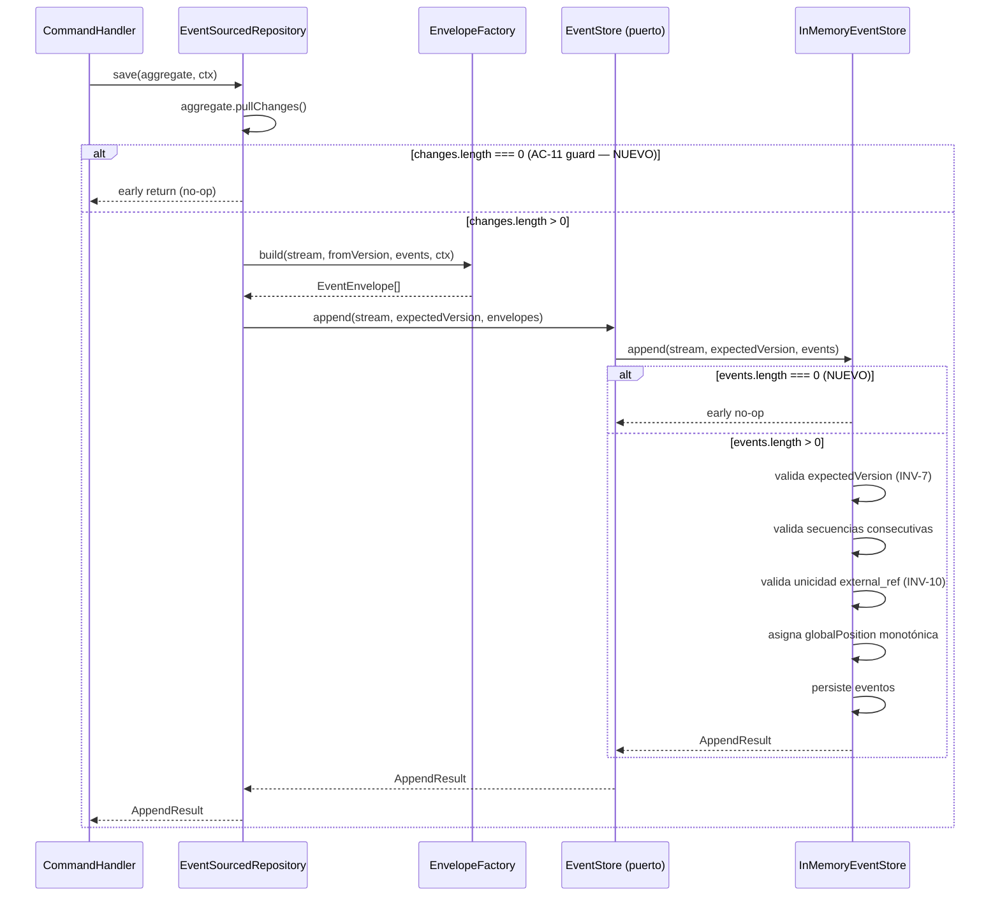

# Diagrama de flujo: hu-0002

> **Nota:** Este es un flujo interno de `apps/ledger`. No hay comunicación entre microservicios.
> Los dos bloques marcados `(NUEVO)` son el alcance concreto de esta historia de verificación:
> el guard de lote vacío en `EventSourcedRepository.save()` y en `InMemoryEventStore.append()`,
> más el test de contract correspondiente en `describeEventStoreContract`.
