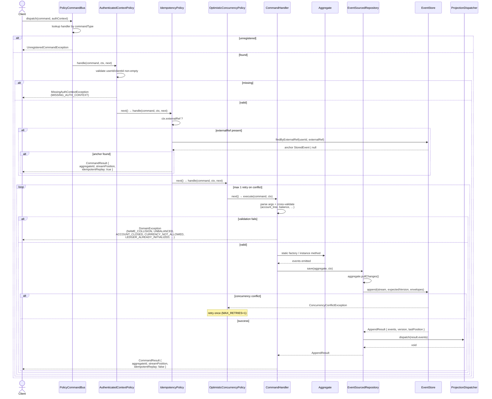
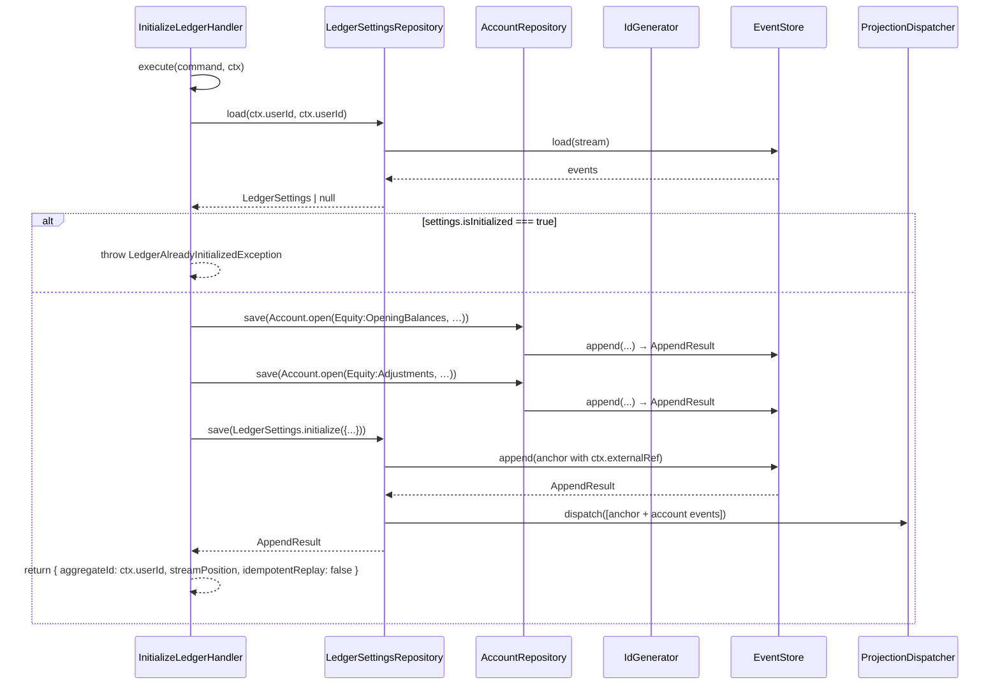
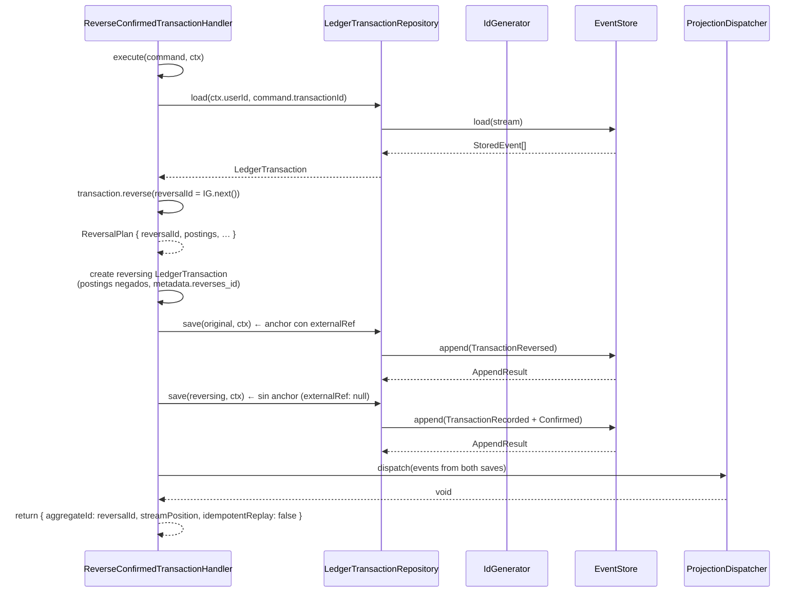

# Diagrama de flujo: hu-0005

## Dispatch de un command con cadena de políticas

## Inicialización de ledger (InitializeLedger — detalle del handler)

## ReverseConfirmedTransaction — append atómico con reversa

> **Flujo interno de `apps/ledger`.** No hay comunicación entre microservicios.
> El orden fijo de políticas (`AuthenticatedContextPolicy` → `IdempotencyPolicy` →
> `OptimisticConcurrencyPolicy`) está cableado en `createLedgerApplication()` y
> nunca se invierte ni se omite.
