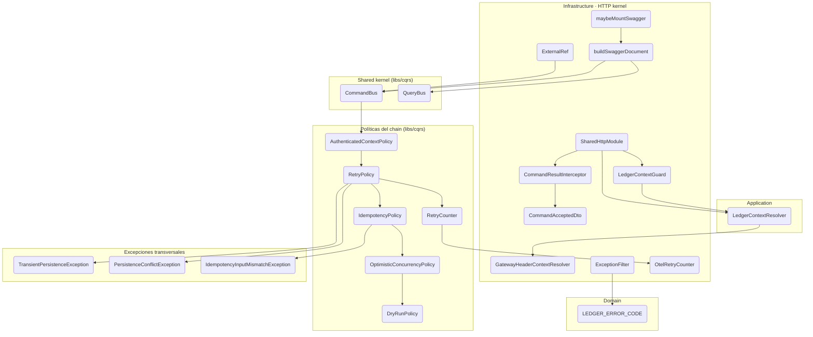

# Shared — Kernel HTTP y dominio compartido

Propósito: adaptadores HTTP compartidos (guard, interceptor, decoradores de contexto,
DTO de respuesta de escritura) + código de dominio transversal (Money, puertos de
contexto). Es el glue que conecta NestJS con el núcleo hexagonal de
[`libs/cqrs`](../../../../libs/cqrs/README.md).

Esta unidad documenta tres raíces de código:

- **`apps/ledger/src/shared`** — el kernel HTTP del ledger (guard, interceptor, decoradores
  de contexto, DTO de respuesta de escritura) y el dominio compartido (`Money`, `LedgerContext`).
- **`apps/ledger/src/config`** — el bootstrap de Swagger (`buildSwaggerDocument`,
  `maybeMountSwagger`). Vive acá en vez de en su propia unidad porque es configuración de
  infraestructura sin casos de uso propios.
- **`apps/ledger/src/tooling`** — los verificadores CLI (`ChainVerifier`,
  `ConsistencyVerifier`). Están acá por la misma razón: son tooling de build, no módulos
  de negocio.

## Diagramas

**Componentes (C4 Nivel 3).** Los nodos nombran la clase real; el gate de CI
(`npm run docs:validate`) falla si alguno deja de existir.

## Casos de uso (flujos)

| Flujo | Slug | Trigger | Entrypoint |
|---|---|---|---|
| Swagger Docs | [`get-swagger-docs`](./flows/get-swagger-docs.md) | rest | `GET /api/docs` |
| Command Dispatch | [`command-dispatch`](./flows/command-dispatch.md) | rest | `POST /api/v1/*` |
| Query Dispatch | [`query-dispatch`](./flows/query-dispatch.md) | rest | `GET /api/v1/*` |
| Map Domain Error | [`map-domain-error`](./flows/map-domain-error.md) | rest | `ALL /api/v1/*` |
| Escritura idempotente | [`idempotent-write`](./flows/idempotent-write.md) | rest | `POST /api/v1/*` con `X-External-Ref` |
| **Preview sin efectos** | [`dry-run-preview`](./flows/dry-run-preview.md) | rest | `POST /api/v1/*` con `dryRun: true` |
| **Reintento transitorio** | [`retry-transient-failure`](./flows/retry-transient-failure.md) | rest | política transversal del `CommandBus` |

## Invariantes

- **RNF-10 (CQRS estricto):** escrituras al command bus, lecturas al query bus.
- **RNF-11 (aislamiento hexagonal):** el núcleo (Domain + Application) no conoce NestJS.
- **AC-4:** el controller solo hace mapeo de forma (headers/body → command/query).
- **AC-5:** toda escritura retorna `CommandAcceptedDto { id, streamPosition }`.
- **AC-6:** controllers dependen solo de `CommandBus`/`QueryBus`.
- **Artículo 5 (Aislamiento por usuario):** todo query incluye `userId` en el contexto.
- **RF-14:** todo fallo de dominio/puerto responde `ErrorResponseBody` con un `code`
  estable de `LEDGER_ERROR_CODE` y el status de su familia; el status de un code es
  contrato (cambiarlo = breaking, agregar uno = aditivo).

## Lenguaje ubicuo

| Término | Definición |
|---|---|
| CommandBus | Puerto abstracto que despacha un command al handler registrado, aplicando políticas (auth, idempotencia, concurrencia). |
| QueryBus | Puerto abstracto que resuelve queries contra proyecciones. |
| CommandResult | `{ aggregateId, streamPosition, idempotentReplay }` — el único retorno de un command handler. |
| CommandAcceptedDto | `{ id, streamPosition }` — proyección HTTP del CommandResult; `streamPosition` como string decimal. |
| AuthContext | `{ userId, clientId, externalRef }` — contexto de escritura ensamblado desde headers HTTP. |
| QueryContext | `{ userId }` — contexto de lectura particionado por usuario. |
| LedgerContextResolver | Puerto abstracto que resuelve el contexto autenticado (implementación actual: headers `x-user-id`/`x-client-id`). |
| CommandResultInterceptor | Interceptor global que transforma `CommandResult` → `CommandAcceptedDto` + header `X-Ledger-Stream-Position`. |
| LedgerContextGuard | Guard global (APP_GUARD) que rechaza requests sin contexto autenticado (RF-26). |
| ExceptionFilter | Filter global (`@Catch()` de `@shared`) que mapea toda `DomainException` a `ErrorResponseBody`; error no tipado → 500 sin `code`. |
| ErrorResponseBody | `{ statusCode, error, message, code?, path, timestamp }` — cuerpo uniforme de toda respuesta de error (RF-14). |
| LEDGER_ERROR_CODE | Const de dominio (`shared/domain/errors/`) — fuente única de los `code` estables que el API expone. |
