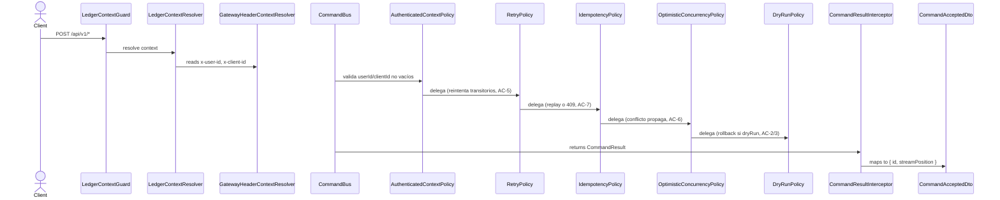
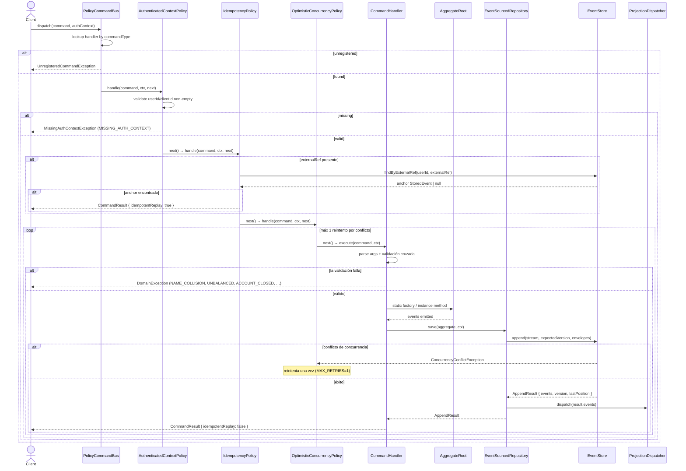

# Command Dispatch (HTTP → CommandBus)

Patrón canónico de controller para escrituras. Todo POST/PATCH sobre recursos de negocio
sigue el mismo pipeline: el `LedgerContextGuard` (APP_GUARD global, RF-26) intercepta cada
request, resuelve el contexto autenticado vía `LedgerContextResolver` (actualmente
`GatewayHeaderContextResolver`: headers `x-user-id`/`x-client-id`), y lo adjunta al request.
El controller ensambla un `AuthContext` desde fuentes disjuntas (`@Context()` para
`userId`/`clientId`, `@ExternalRef()` para el idempotency key) y despacha el command al
`CommandBus`. El `CommandResultInterceptor` transforma `CommandResult` en
`CommandAcceptedDto { id, streamPosition }` + header `X-Ledger-Stream-Position`.

> **Validación del contexto autenticado.** `AuthenticatedContextPolicy` es el primer
> eslabón: si `userId` o `clientId` están ausentes o vacíos lanza
> `MissingAuthContextException` y la cadena no continúa; si el contexto es válido delega
> al siguiente vía `next()`.

### El dispatch completo, hasta el event store

El diagrama de arriba muestra el chain de políticas. Este muestra el recorrido entero,
con las ramas de error de cada eslabón — es el que se usaba para razonar el
`PolicyCommandBus` desde hu-0005.

## Reglas

- **AC-1 (RF-26):** Request sin header `x-user-id` → `LedgerContextGuard` rechaza con 401.
- **AC-2 (RF-26):** Request sin header `x-client-id` → 401.
- **AC-3:** Ambos headers presentes → `LedgerContextResolver.resolve()` produce `{ userId, clientId }`, guard lo adjunta a `request.ledgerContext`.
- **AC-4 (RNF-10):** El controller solo hace mapeo de forma: headers/body → command, `CommandResult` → `CommandAcceptedDto`. No toca agregados, eventos, ni proyecciones.
- **AC-5:** `LedgerContextGuard` registrado como `APP_GUARD` global. Endpoint marcado `@Public()` (health) omite el guard vía `Reflector` + `IS_PUBLIC`.
- **AC-6:** `client_id` llega hasta el command sin interpretación ni validación: el ledger solo exige su presencia y lo registra como metadata (RF-12).
- **AC-7:** Binding intercambiable: `{ provide: LedgerContextResolver, useClass: GatewayHeaderContextResolver }`. Cambiar a JWT es reemplazar el provider, sin tocar controllers (RNF-11).
- **RNF-10:** Escrituras al command bus, lecturas al query bus.

## Errores

| Condición | Excepción | HTTP |
|---|---|---|
| Sin header `x-user-id` | `UnauthorizedException` (desde `LedgerContextGuard`) | 401 |
| Sin header `x-client-id` | `UnauthorizedException` (desde `LedgerContextGuard`) | 401 |
| Header duplicado (array) | `LedgerContextResolver.resolve()` → `null` → `UnauthorizedException` | 401 |
| Header en blanco | `LedgerContextResolver.resolve()` → `null` → `UnauthorizedException` | 401 |
| Policy de command bus: `userId` vacío en `AuthContext` | `MissingAuthContextException` (code `MISSING_AUTH_CONTEXT`) | 422 |
| Policy de command bus: `clientId` vacío en `AuthContext` | `MissingAuthContextException` (code `MISSING_AUTH_CONTEXT`) | 422 |
| Idempotency replay (mismo `external_ref` + mismo usuario) | `CommandResult.idempotentReplay === true` | 200 (downgradeado por `CommandResultInterceptor`) |

## Respuesta

- **201:** `CommandAcceptedDto { id: string, streamPosition: string }` + header `X-Ledger-Stream-Position: <streamPosition>`.
- **200:** Replay idempotente (mismo `external_ref` ya procesado, `CommandResult.idempotentReplay === true`).
- **401:** Contexto autenticado ausente o inválido — `LedgerContextGuard` bloquea antes de llegar al controller.
