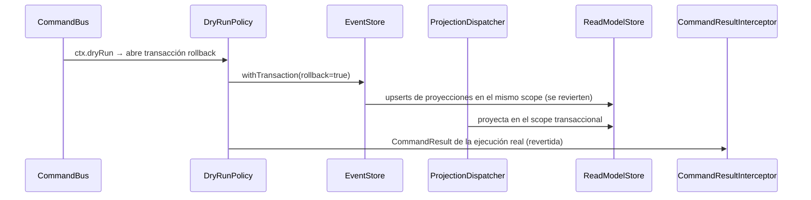

# Preview sin efectos (`dryRun`)

Con `body.dryRun = true`, `DryRunPolicy` ejecuta el handler **completo** dentro de
`EventStore.withTransaction(rollback = true)` y devuelve el `CommandResult` que la
ejecución real habría producido — sin que nada quede persistido.

No es una simulación ni un camino alternativo: es la ejecución real, revertida. Por eso el
resultado es fiel, incluidos los errores de dominio, que se lanzan igual.

**Todo se une al mismo scope transaccional.** Los appends de eventos ya consultan el
`AsyncLocalStorage`, y las proyecciones síncronas escriben por ese mismo scope
(`PostgresReadModelStore` pasa a consultarlo). Al resolver el work, la transacción hace
rollback y ni el stream ni los read models conservan rastro.

**Nada llega al stream, así que los reactors no se disparan.**
`ReevaluateAssertionsReactor` (§3.2) no se entera de un dry-run — que es exactamente lo
que se espera de un preview.

> Este flow se creó en spec-0033. El comportamiento existe desde hu-0025 y varios flows ya
> lo enlazaban, pero el documento no existía: `transactions/flows/reverse-transaction.md`
> apuntaba a esta ruta desde hu-0026 con un link roto.

## Reglas

- **`dryRun` es metadata de transporte**, no un input del comando: viaja en el
  `AuthContext` y queda **fuera** del hash de idempotencia. Dos requests idénticos que solo
  difieran en `dryRun` no colisionan por `external_ref`.
- **El campo va en el body**, validado con `class-validator`, no como query param.
- **Default `false`.** Un cliente que no conoce el campo se comporta como antes.
- **Las validaciones de dominio corren igual.** Un comando inválido falla en dry-run con el
  mismo código de error que fallaría en real.
- **Los reactors no se disparan**, porque nada llega al stream.

## Respuesta

El mismo cuerpo y código que habría devuelto la ejecución real —`CommandAcceptedDto` con
`id` y `streamPosition`— como preview de un efecto que fue revertido.
