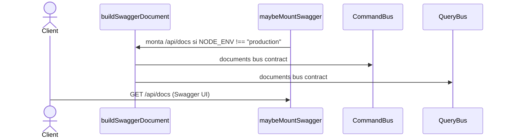

# Swagger Docs

Sirve la UI de Swagger en `/api/docs` (`SwaggerModule.setup('docs', ...)`) montada por
`maybeMountSwagger(app, showDocs)` durante el bootstrap. El montaje respeta el prefijo
global `api` pero no el versionado URI (`/api/v1/docs` no existe — Swagger no registra
rutas por versión).

El documento OpenAPI se construye con `buildSwaggerDocument()` desde decoradores
`@nestjs/swagger` en controllers y DTOs, garantizando que el contrato publicado no diverge
de la implementación.

## Reglas

- **AC-2:** Swagger UI solo se monta cuando `NODE_ENV !== 'production'` (controlado por `config.showDocs`).
- **AC-3:** El documento declara dos esquemas de seguridad: `gatewayContext` (apiKey, header `x-user-id`, default) y `bearerAuth` (JWT). Ambos disponibles, ninguno bloqueante para la decisión de identidad (hu-0010).

## Errores

| Condición | Excepción | HTTP |
|---|---|---|
| Entorno producción (`NODE_ENV === 'production'`) | No se monta Swagger — `maybeMountSwagger` es no-op | — |

## Respuesta

- **200:** HTML de Swagger UI renderizado por `SwaggerModule.setup`.
- **Montaje en producción:** no se registra la ruta — el router de Express devuelve 404.
