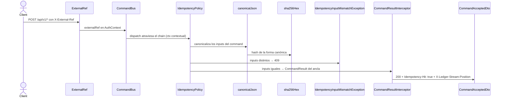

# Escritura idempotente y read-your-writes (RF-11 / RNF-9)

Cómo el borde HTTP transporta el `external_ref`, cómo el `CommandBus` lo convierte en
idempotencia, y por qué un `GET` inmediato después de un `2xx` ya ve la escritura.

El ledger **no** replica el `IdempotencyInterceptor` de `finances` ni su tabla propia: el
borde HTTP solo transporta el valor y la semántica vive en el `CommandBus`, respaldada por el
índice único `(user_id, external_ref)` del `EventStore`.

**Cambio de hu-0024.** Hasta esta historia el `external_ref` era una pura clave de reintento:
reenviarla con datos distintos replayaba el resultado viejo y la operación nueva se perdía sin
error ni traza. Ahora la política **compara los inputs** y rechaza el reuso con datos distintos.

## Recorrido

1. **`@ExternalRef()`** (`external-ref.decorator.ts`) extrae la clave: header `X-External-Ref`
   preferido, fallback a `external_ref` del body, `null` si ninguno es un string no vacío. Ambas
   fuentes se recortan con `trim()`; un header repetido llega como array y **no** se acepta.
2. El **controller** lo pasa al `dispatch` dentro del `AuthContext`. No decide nada.
3. **`IdempotencyPolicy`** (segunda del chain, tras `AuthenticatedContextPolicy`):
   - Sin `externalRef` → `next(ctx)`, sin idempotencia.
   - Con `externalRef` → calcula `inputHash = sha256Hex(canonicalJson(idempotencyInput))` y busca
     el evento ancla con `EventStore.findByExternalRef(userId, externalRef)`.
     - **Ancla existe y `anchor.externalRefHash === inputHash`** → replaya:
       `{ aggregateId, streamPosition, idempotentReplay: true }`, sin ejecutar el handler.
     - **Ancla existe y los hashes difieren** → lanza `IdempotencyInputMismatchException`.
     - **No existe** → `next({ ...ctx, externalRefHash: inputHash })`. El contexto enriquecido
       baja por el chain hasta el handler.
   - Si el índice único rechaza la escritura por una carrera concurrente
     (`DuplicateExternalRefException`), atrapa el error, relee el ancla y **vuelve a aplicar la
     misma comparación**: el mismatch no se escapa por concurrencia.
4. **`EnvelopeFactory`** estampa `externalRefHash` en el evento ancla con la misma línea
   `index === 0` que ya usa para `externalRef`. El adaptador lo persiste en
   `external_ref_hash`, en la misma escritura atómica que el evento.
5. **`CommandResultInterceptor`** estampa `X-Ledger-Stream-Position` y, cuando
   `idempotentReplay === true`, agrega `Idempotency-Hit: true` y degrada el status a `200`.

## Reglas

- **AC-1:** El header gana sobre el body. `null` cuando ninguno está presente; el `external_ref`
  es opcional hoy (sin registro de clientes, §2.10, no se exige por `client_id`).
- **AC-2 (INV-10 / RNF-4):** Dos escrituras con el mismo `external_ref` **y los mismos inputs**
  emiten eventos una sola vez; la segunda devuelve el **mismo** `aggregateId` y `streamPosition`,
  con status `200`.
- **AC-3 — reemplazada por hu-0024.** La política **sí** compara ahora los inputs del command. La
  redacción anterior («`IdempotencyPolicy` no compara el command… el `external_ref` es una clave
  de reintento del cliente, no un detector de colisiones») dejó de ser cierta.
- **AC-5 (hu-0024) — qué se hashea.** El `idempotencyInput` es el objeto `Command` completo más
  el `userId`, canonicalizado con la misma función que la cadena de eventos (AC-1 de
  `event-store-append`). Se **excluyen** los metadatos de transporte: la propia `external_ref`,
  el `clientId`, y cualquier id de correlación o timestamp generado por el request. El mismo
  command reenviado desde otro cliente o con otro trace id es un acierto de idempotencia, no un
  conflicto.
- **AC-6 (hu-0024) — reuso con datos distintos.** `409 IDEMPOTENCY_INPUT_MISMATCH`, indicando la
  `external_ref` en conflicto. Cubre **los dos** caminos de la política (el pre-check y el catch
  de la carrera concurrente), no solo el primero.
- **AC-7 (hu-0024) — la respuesta señala el acierto.** `Idempotency-Hit: true` solo en el replay.
  Cuando la operación se ejecutó de verdad la cabecera **no está presente**: su ausencia es la
  señal, no un valor `false`.
- **AC-8 (hu-0024) — sin comparación contra nulos.** El CHECK del esquema garantiza
  `(external_ref IS NULL) = (external_ref_hash IS NULL)`, así que un ancla con `external_ref`
  siempre tiene su hash. No existe rama de "hash ausente".
- **Contexto contextual en el chain.** `CommandNext` pasa a ser
  `(ctx: AuthContext) => Promise<CommandResult>`: una política puede reemplazar el contexto que
  ven las de abajo. Es lo que permite que el hash calculado por `IdempotencyPolicy` llegue al
  `EnvelopeFactory` sin que el bus ni el puerto sepan nada de idempotencia.
- **AC-4 (RNF-9):** Toda escritura de los controllers de EP-2 expone `streamPosition` en el body
  (`CommandAcceptedDto`) y en el header `X-Ledger-Stream-Position`. El interceptor es **opt-in
  por controller** (`@UseInterceptors`), no `APP_INTERCEPTOR`: lo declaran `AccountsController`,
  `LedgerController` y `TransactionsController`; los controllers de EP-3 ya montados
  (`BalanceAssertionController`, `TransferController`) no. **Consecuencia para AC-7:** esos tres
  endpoints de `reconciliation` tampoco reciben `Idempotency-Hit` ni el downgrade a `200`. Es la
  misma limitación preexistente, no una nueva; corregirla está fuera del alcance de hu-0024.
  El `409` de AC-6, en cambio, **sí** los alcanza: la política corre para todos los commands.
- **AC-5 (read-your-writes):** proyección **inline**: cada handler hace `repository.save(...)` y
  luego `dispatcher.dispatch(result.events)` dentro del mismo request. Las dos operaciones son
  secuenciales pero **no comparten transacción** — no existe `UnitOfWork` entre `EventStore` y
  `ReadModelStore`.
- **No implementado:** `min_position` / `X-Ledger-Min-Position` no existen.

## Errores

| Condición | Resultado | HTTP |
|---|---|---|
| `external_ref` ausente | Sin idempotencia; el command corre normal | 201 |
| `external_ref` repetido, **mismos inputs** | Replay del `CommandResult` original + `Idempotency-Hit: true` | 200 |
| `external_ref` repetido, **inputs distintos** | `IdempotencyInputMismatchException` | **409** |
| Mismo command desde otro `client_id` o con otro trace id | Replay (esos campos no entran al hash) | 200 |
| Carrera concurrente sobre el índice único, mismos inputs | `DuplicateExternalRefException` atrapada → replay | 200 |
| Carrera concurrente sobre el índice único, inputs distintos | Atrapada → relee el ancla → `IDEMPOTENCY_INPUT_MISMATCH` | **409** |
| Ancla reportada duplicada pero ausente al releer | `DuplicateExternalRefException` propagada (bug de consistencia) | 409 |

## Respuesta

- **201:** `CommandAcceptedDto { id, streamPosition }` + `X-Ledger-Stream-Position`, sin
  `Idempotency-Hit`.
- **200:** Idéntico cuerpo y header, más `Idempotency-Hit: true`. El cliente puede distinguir el
  replay por el status o por la cabecera, sin parsear el body.
- **409:** `ErrorResponseBody` con `code: IDEMPOTENCY_INPUT_MISMATCH` — ver
  [`map-domain-error.md`](./map-domain-error.md).
