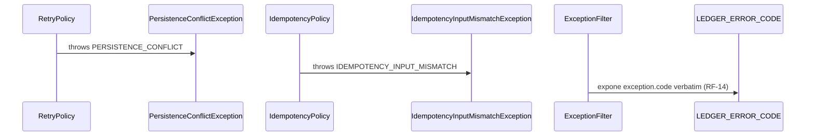

# Map Domain Error (fallo de dominio/puerto → ErrorResponseBody)

Todo fallo de dominio o de puerto que ocurre durante el dispatch de un command o query
burbujea como `DomainException` hasta el `ExceptionFilter` global (registrado en
`main.ts`, implementado en `libs/shared`). El filter lee `exception.status` y
`exception.code` y produce el cuerpo uniforme `ErrorResponseBody`
(`{ statusCode, error, message, code, path, timestamp }`). No existe ningún `catch`
especial por familia de excepción: las excepciones de puerto (`CONCURRENCY_CONFLICT`,
`DUPLICATE_EXTERNAL_REF`) extienden la misma jerarquía `DomainException` y se mapean
por el mismo camino. Un error no tipado se mapea a `500` **sin** `code` ni detalles
internos.

**Delta hu-0024:** se suma `IDEMPOTENCY_INPUT_MISMATCH` (409) a la tabla congelada, y se
reescribe la nota sobre `DUPLICATE_EXTERNAL_REF`, que atribuía a ese código un caso que ahora
tiene el suyo propio.

**Delta hu-0026:** se suma `TRANSACTION_ALREADY_REVERSED` (409) a la tabla congelada. Es
aditivo — ningún código existente cambia de status — pero **reparte** un caso que hasta ahora
cubría `INVALID_TRANSACTION_STATE`: la doble reversa de una confirmada pasa a tener código
propio, y el código viejo se queda con el resto de los estados no reversables. Sin pasos
nuevos en el diagrama: el código entra por el mismo camino del filter, como toda
`DomainConflictException`.

## Reglas

- **RF-14:** todo fallo de dominio/puerto responde con un `code` estable de la tabla y
  su status HTTP; el cuerpo sigue `ErrorResponseBody`. El consumidor hace branching
  sobre `code`, nunca sobre `message`.
- **AC-1:** un único filter global (`@Catch()` de `libs/shared`) registrado en
  `main.ts` — no se escriben filters por módulo ni por familia.
- **AC-3:** las excepciones del puerto `EventStore` (`ConcurrencyConflictException`,
  `DuplicateExternalRefException`) extienden `DomainConflictException` — mismo filter,
  mismo camino. `IdempotencyInputMismatchException` (hu-0024) extiende la misma clase y
  entra por el mismo camino, aunque la lance una política y no el puerto.
  `TransactionAlreadyReversedException` (hu-0026) también extiende `DomainConflictException`
  y la lanza el agregado (`LedgerTransaction.reverse()`), no una política ni un puerto.
- **AC-4:** `LEDGER_ERROR_CODE`
  (`apps/ledger/src/shared/domain/errors/ledger-error-code.ts`) es la fuente única de
  los strings. Agregar un code es aditivo; cambiar el status de un code existente es
  **breaking** (nueva versión del API).
- **AC-5:** el mapeo está congelado por un contract test tabular
  (`ledger-error-code-mapping.spec.ts`) que ejecuta cada excepción a través del filter
  y afirma `{ statusCode, code }`. Agregar un code obliga a agregar su fila — hu-0024
  agrega la de `IDEMPOTENCY_INPUT_MISMATCH`, hu-0026 la de `TRANSACTION_ALREADY_REVERSED`.
- **AC-6:** un error no tipado → `500` sin `code` de dominio ni detalles internos.
- **AC-7 — reescrita por hu-0024.** El *replay* idempotente (misma `external_ref`, **mismos
  inputs**) no es un error: lo resuelve EP-1 devolviendo el resultado original (200 downgrade +
  `Idempotency-Hit: true` vía `CommandResultInterceptor`). El caso patológico —misma
  `external_ref` con **inputs distintos**— ya no es un replay silencioso: es
  `IDEMPOTENCY_INPUT_MISMATCH` (409).
- **422** para violaciones semánticas del payload reprocesables corrigiéndolo.
- **409** para conflictos de **estado** del agregado/stream, y para el reuso de una clave de
  idempotencia con datos distintos.
- **404** para recursos inexistentes dentro del scope del usuario.

## Errores (tabla congelada RF-14)

Solo se listan las filas que hu-0024 y hu-0026 agregan o modifican; el resto de la tabla
queda intacto.

| Condición | Excepción | code | HTTP |
|---|---|---|---|
| **NUEVO (hu-0024)** — misma `external_ref` del usuario con inputs distintos (AC-6) | `IdempotencyInputMismatchException` | `IDEMPOTENCY_INPUT_MISMATCH` | 409 |
| Violación del índice único `(user_id, external_ref)` en el puerto — **no alcanzable vía command bus**, ver nota | `DuplicateExternalRefException` | `DUPLICATE_EXTERNAL_REF` | 409 |
| **NUEVO (hu-0026)** — se intenta reversar una transacción que ya fue revertida | `TransactionAlreadyReversedException` | `TRANSACTION_ALREADY_REVERSED` | 409 |

> **Nota sobre el reparto de hu-0026.** Antes de hu-0026, `INVALID_TRANSACTION_STATE` cubría
> tanto «la transacción no está CONFIRMED» como «ya está revertida». La segunda es accionable
> de otra forma (la corrección ya existe; se busca por `reverses_id`), así que gana su propio
> código. `INVALID_TRANSACTION_STATE` sigue vigente para el resto de los estados no
> reversables.

> **Nota sobre los dos códigos de idempotencia (reescribe la nota de hu-0012).**
> Los dos describen fallas distintas en capas distintas:
>
> - **`IDEMPOTENCY_INPUT_MISMATCH` (409)** es el contrato de `IdempotencyPolicy` y **sí** lo
>   emite el API HTTP. Salta cuando una `external_ref` ya vista llega con inputs distintos,
>   tanto en el pre-check como al atrapar la carrera concurrente.
> - **`DUPLICATE_EXTERNAL_REF` (409)** se queda como contrato del **puerto** `EventStore` ante
>   la violación del índice único, alcanzable por cualquier caller que use el store sin la
>   política. **Sigue sin ser emitido por el API HTTP:** con la política puesta, esa excepción
>   se atrapa y se resuelve como replay o como mismatch.
>
> Queda **obsoleta** la redacción de hu-0012 que reservaba `DUPLICATE_EXTERNAL_REF` para
> «mismo `external_ref` con un command distinto/conflictivo»: ese caso ahora tiene su propio
> código. Ver [`idempotent-write.md`](./idempotent-write.md).

## Respuesta

- **4xx de dominio/puerto:** `ErrorResponseBody { statusCode, error, message, code, path, timestamp }` —
  ver schemas `ErrorResponseBody` y `LedgerErrorCode` en [`../api.yaml`](../api.yaml).
- **500:** `ErrorResponseBody` sin `code` (la clave se omite del cuerpo).
