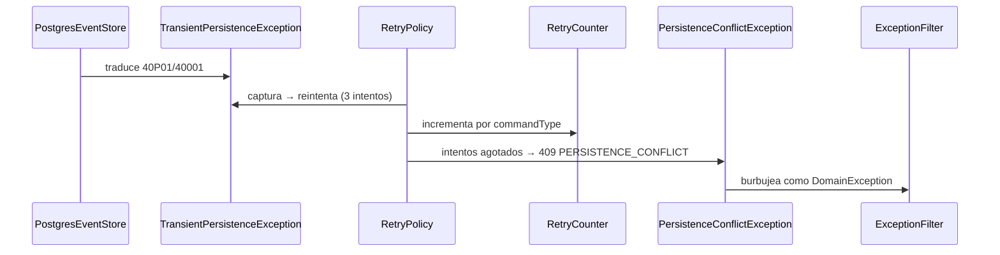

# Reintento ante fallos transitorios del motor

`PostgresEventStore.translate()` convierte los códigos `40P01` (deadlock detectado) y
`40001` (fallo de serialización) en `TransientPersistenceException`. `RetryPolicy` la
captura y **reintenta el comando completo** —3 intentos totales, backoff exponencial con
jitter— incrementando `RetryCounter` etiquetado por tipo de comando.

Al agotar los intentos lanza `PersistenceConflictException`, que el filtro traduce a
`PERSISTENCE_CONFLICT` (409).

**Solo esos dos códigos son transitorios**, y son los canónicos de PostgreSQL para el caso:
reintentar cualquier otro error del motor enmascararía un defecto real.

**Dos excepciones deliberadamente no se capturan**, porque no son fallos del motor sino
contratos de otras políticas:

| Excepción | Quién la resuelve | Por qué no se reintenta |
|---|---|---|
| `ConcurrencyConflictException` | `OptimisticConcurrencyPolicy` | El conflicto de versión se propaga al cliente (AC-6): reintentarlo pisaría una escritura ajena. |
| `DuplicateExternalRefException` | `IdempotencyPolicy` | Es una repetición legítima, no un fallo: se resuelve como replay. |

> Este flow se creó en spec-0033. El comportamiento existe desde hu-0025, documentado solo
> como `dynamic view` en el modelo LikeC4.

## Reglas

- **3 intentos totales** (el original más 2 reintentos), con backoff exponencial y jitter
  para no sincronizar clientes que reintentan a la vez.
- **`TransientPersistenceException` nunca llega al API.** O se resuelve en un reintento, o
  se convierte en `PERSISTENCE_CONFLICT`.
- **El reintento es del comando completo**, no del append: el handler vuelve a correr desde
  cero, rehidratando el agregado.
- **`RetryCounter` se incrementa por `commandType`**, lo que permite detectar qué comando
  concentra la contención.

## Errores

| Condición | Excepción | code | HTTP |
|---|---|---|---|
| Reintentos agotados | `PersistenceConflictException` | `PERSISTENCE_CONFLICT` | 409 |
