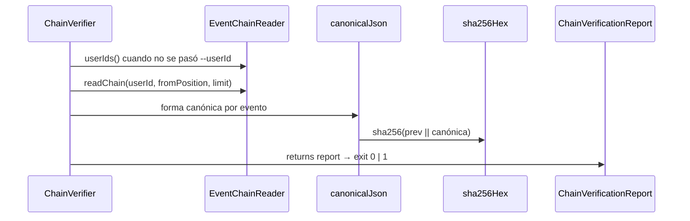

# Verificar la cadena de hashes del event store

Recorre el stream en orden de `global_position`, recomputa el hash de cada evento a partir de
sus propios datos y lo compara contra el hash persistido. Si alguien alteró una fila del
`event_store` por fuera del append — saltándose el trigger, restaurando un dump editado,
tocando la base a mano — el hash recomputado deja de coincidir y el comando lo reporta.

Verifica **dos cosas a la vez**: que la canonicalización siga produciendo el mismo string
(porque recomputa desde los campos, no desde un canónico guardado) y que el encadenamiento
esté intacto (porque arrastra el hash anterior).



## Recorrido

1. **Resolver el alcance.** Con `--userId` verifica esa cadena; sin el flag pide
   `EventChainReader.userIds()` y recorre todas — el uso de CI no conoce los ids de antemano.
2. **Paginar la cadena.** `readChain(userId, fromPosition, limit)` devuelve
   `ChainRow { globalPosition, eventId, hash, chainInput }` en orden de `global_position`. El
   adaptador arma `chainInput` con la **misma** función de proyección que usa el append al
   escribir, de modo que verificar y persistir no puedan divergir.
3. **Recomputar y comparar.** Arrancando desde la cadena vacía `""`, por cada fila:
   `esperado = sha256Hex(prev || canonicalJson(row.chainInput))`. Si `esperado !== row.hash`, se
   registra la ruptura y **se sigue** — el hash anterior para la fila siguiente es el
   **recomputado**, no el persistido: la fila siguiente fue escrita en su momento encadenando
   contra el hash verdadero de esta fila, no contra el valor que quedó alterado después, así
   que confiar en el recomputado es lo que evita que una sola alteración se propague como
   ruptura en cascada sobre todos los eventos posteriores.
4. **Reportar.** `ChainVerificationReport { ok, usersChecked, eventsChecked, breaks }`.

## Reglas

- **AC-4 (no se detiene):** termina el recorrido completo y reporta **todas** las rupturas, cada
  una con su `userId`, `globalPosition`, `eventId`, hash esperado y hash obtenido. Conocer el
  alcance del daño en una sola corrida vale más que ahorrar el recorrido.
- **AC-4 (exit code):** `0` si todas las cadenas verifican, `1` si hubo al menos una
  discrepancia. Es lo que hace al comando usable tal cual como paso de CI. Se implementa con
  `process.exitCode = 1` (no `process.exit`) para que el `finally` alcance a cerrar el
  `DataSource`.
- **AC-4 (alcance):** `--userId` es opcional. Sin el flag el reporte agrega el total de usuarios
  y de eventos verificados.
- **INV-9:** cada cadena se verifica de forma independiente; el recorrido nunca cruza usuarios.
  Una ruptura en un usuario no contamina el resultado de otro.
- **INV-12:** solo lee. `EventChainReader` no expone ninguna escritura, así que el verificador no
  puede modificar el stream ni por error de programación.
- **Reencadenado tras una ruptura:** al continuar con el hash recomputado, una fila alterada
  produce exactamente **una** ruptura (la suya) en vez de N. Si en cambio se alteró el orden o se
  borró una fila, las rupturas se propagan — que es la señal correcta.

## Errores

| Condición | Excepción | Comportamiento |
|---|---|---|
| `--userId` no es un UUID | Error de validación | El CLI aborta con mensaje descriptivo, exit `1` |
| El usuario no tiene eventos | — | `{ ok: true, eventsChecked: 0 }` — cadena vacía es trivialmente válida |
| La base no tiene ningún evento | — | `{ ok: true, usersChecked: 0 }`, exit `0` |
| Un hash no coincide | — | Se registra en `breaks`, el recorrido continúa, exit final `1` |
| Falla la conexión a la base | Error de infraestructura | Se propaga; el CLI lo imprime y sale con `1` |

## Respuesta

Salida por consola, sin API HTTP. El efecto observable es el exit code.

**OK:**

```
Chain verified: 3 users, 1043 events, 0 breaks.
```

**Con rupturas:**

```
BROKEN  user=550e8400-…  pos=42   evt=a1b2c3d4-…
  expected 9f3c…  got 77de…
BROKEN  user=550e8400-…  pos=91   evt=c3d4e5f6-…
  expected 22aa…  got 5b1f…
Chain verification FAILED: 3 users, 1043 events, 2 breaks.
```

## Deuda registrada

`verify-balances` (hu-0008) **no** setea exit code ante drift: solo imprime. `verify-chain`
estrena el comportamiento correcto, así que los dos subcomandos quedan inconsistentes entre sí.
Alinear `verify-balances` está fuera del alcance de esta historia.
