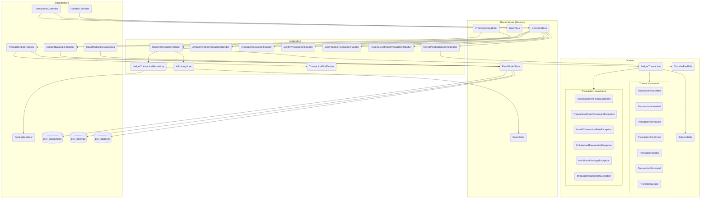

# Módulo: transactions (apps/ledger)

> C4 Nivel 3 · documentación viva. El diagrama de componentes vive acá; cada flujo lleva
> su diagrama de secuencia inline en [`flows/`](./flows/). Este README es el arc42-lite
> del módulo.

## Propósito

Registra y gobierna el ciclo de vida de los asientos contables por partida doble
(`LedgerTransaction`), incluida la fusión de dos pendientes en una transferencia.
Event-sourced: cada transición emite un evento y las proyecciones construyen listados y
saldos.

Detectar *qué* pendientes fusionar es del cliente, no del ledger: RF-15 salió del alcance
en la versión 0.8 de la spec (§4.2). Este módulo valida el par que el cliente le nombra.

## Diagramas

**Componentes (C4 Nivel 3).** Los nodos nombran la clase real; el gate de CI
(`npm run docs:validate`) falla si alguno deja de existir.

**Flujos:** ver [`flows/`](./flows/) — cada uno lleva su `sequenceDiagram` inline,
renderizado nativo en GitHub y en el preview de VS Code.

## Casos de uso (flujos)

| Caso de uso | Trigger | Entrypoint | Doc |
|---|---|---|---|
| Registrar transacción | rest | `POST /transactions` | [record-transaction](./flows/record-transaction.md) |
| Enmendar (pendiente) | rest | `POST /transactions/{id}/amend` | [amend-transaction](./flows/amend-transaction.md) |
| Anotar | rest | `POST /transactions/{id}/annotate` | [annotate-transaction](./flows/annotate-transaction.md) |
| Confirmar | rest | `POST /transactions/{id}/confirm` | [confirm-transaction](./flows/confirm-transaction.md) |
| Anular (pendiente) | rest | `POST /transactions/{id}/void` | [void-transaction](./flows/void-transaction.md) |
| Reversar (confirmada) | rest | `POST /transactions/{id}/reverse` | [reverse-transaction](./flows/reverse-transaction.md) |
| Listar transacciones | rest | `GET /transactions` | [list-transactions](./flows/list-transactions.md) |
| Consultar transacción | rest | `GET /transactions/{id}` | [get-transaction](./flows/get-transaction.md) |
| **Fusionar patas de transferencia** | rest | `POST /transfers/merge` | [merge-transfers](./flows/merge-transfers.md) |
| **Proyectar transaction_list** | **domain-event** | `SynchronousProjectionDispatcher` → `TransactionListProjector` | [project-transaction-list](./flows/project-transaction-list.md) |
| **Proyectar account_balances** | **domain-event** | `SynchronousProjectionDispatcher` → `AccountBalancesProjector` | [project-account-balances](./flows/project-account-balances.md) |

> Los flujos *proyectar transaction_list* y *proyectar account_balances* no los inicia un usuario por REST sino eventos de dominio consumidos por proyectores. Son el ejemplo de por qué `trigger` es la clave que organiza `flows/`: un mismo módulo tiene entrypoints heterogéneos.

## Invariantes de dominio

| ID | Regla |
|---|---|
| INV-1 / INV-11 | Toda transacción balancea a cero por moneda (`ZeroSumBalanceRule`). |
| INV-2 | Una transacción tiene ≥ 2 postings. |
| INV-6 | `amend`/`void` sólo sobre PENDING; `annotate` en cualquier estado salvo VOIDED. |
| INV-8 | Los montos se representan como decimal exacto (string), nunca float. |
| AC-7 | `confirm` PENDING→CONFIRMED; `reverse` sólo CONFIRMED. |
| RF-4 | `DerivedKind` (EXPENSE/INCOME/TRANSFER/COMPOUND) lo deriva el projector. |

## Lenguaje ubicuo

- **Posting:** línea de un asiento (cuenta, monto con signo, moneda).
- **Transfer:** transacción entre dos cuentas propias. Puede registrarse directamente o
  resultar de fusionar dos pendientes que el cliente identifica como las dos patas del mismo
  movimiento (RF-16).
- **Reversal:** transacción nueva con los postings invertidos de una confirmada.
- **Derived kind:** clasificación calculada por proyección, no capturada por el usuario.

## Contrato

- OpenAPI canónico del módulo: [`api.yaml`](./api.yaml).
