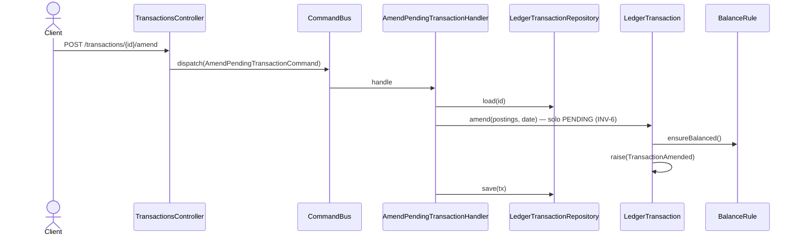

# Enmendar transacción pendiente

Cambio **económico** de una transacción: reemplaza sus postings y su fecha. Solo válido
mientras está `PENDING` (INV-6) — una vez confirmada, el stream es inmutable y el camino es
`reverse`.

**Reemplazo total: `postings` y `date` son requeridos.** `LedgerTransaction.amend(postings,
date, balance)` sustituye ambos wholesale, así que una enmienda parcial no tiene
representación en el dominio. El DTO los declara requeridos y omitir cualquiera devuelve
`400` de validación.

> Antes de `hu-0014` ambos campos eran opcionales y el controller rellenaba con `''` y `[]`,
> lo que producía un `422` desconcertante sobre una fecha vacía (`"" is not a YYYY-MM-DD
> date`). Se alineó el DTO con lo que el dominio soporta.

## Reglas

- **AC-2:** responde `200 CommandAcceptedDto`.
- **INV-1:** los postings de reemplazo deben balancear a cero por moneda — lo verifica
  `BalanceRule` desde el agregado, no el DTO.
- **INV-6:** solo en `PENDING`.
- El handler revalida las cuentas destino vía `AccountValidationService` antes de aplicar:
  una cuenta cerrada o una moneda no permitida se rechazan aquí también.
- **Idempotencia:** ver [`../../shared/flows/idempotent-write.md`](../../shared/flows/idempotent-write.md).

## Errores

| Condición | Excepción | code | HTTP |
|---|---|---|---|
| `postings` o `date` ausentes | `ValidationPipe` (class-validator) | — | 400 |
| Menos de 2 postings | `ArrayMinSize(2)` del DTO | — | 400 |
| Transacción inexistente para el usuario | `TransactionNotFoundException` | `TRANSACTION_NOT_FOUND` | 404 |
| La transacción ya está `CONFIRMED` (INV-6) | `ImmutableTransactionException` | `IMMUTABLE_TRANSACTION` | 409 |
| Postings que no balancean a cero (INV-1) | `UnbalancedTransactionException` | `UNBALANCED_TRANSACTION` | 422 |
| Posting sobre una cuenta cerrada | `AccountClosedException` | `ACCOUNT_CLOSED` | 422 |
| Moneda no permitida por la cuenta | `CurrencyNotAllowedException` | `CURRENCY_NOT_ALLOWED` | 422 |
| `date` fuera de `YYYY-MM-DD` o día inexistente | `InvalidLedgerDateException` | `INVALID_LEDGER_DATE` | 422 |

## Respuesta

`200`: `CommandAcceptedDto { id, streamPosition }` + header `X-Ledger-Stream-Position`.
