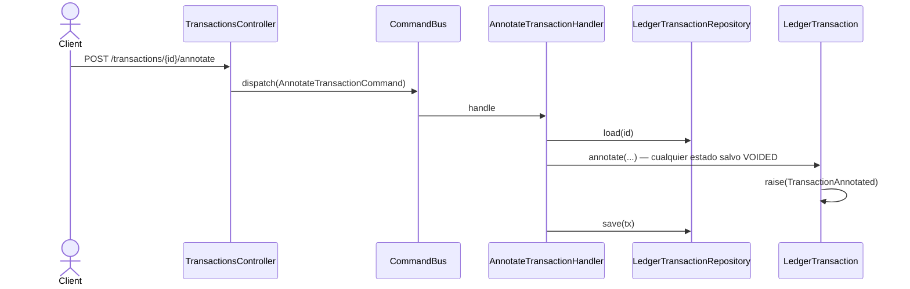

# Anotar transacción

Cambio **no económico**: `payee`, `description`, `invoiceUrl`, `tags` y `metadata`. No toca
postings ni montos, así que es válido en cualquier estado salvo `VOIDED` — incluida una
transacción ya `CONFIRMED`, que sigue siendo inmutable en lo económico.

## Semántica de reemplazo total, no de parche

Aunque todos los campos del DTO son opcionales, **omitir uno lo borra**. El controller
construye el command con defaults vacíos:

```ts
new AnnotateTransactionCommand(
  id,
  dto.payee ?? null,
  dto.description ?? '',
  dto.invoiceUrl ?? null,
  dto.tags ?? [],
  this.toStringMetadata(dto.metadata),
)
```

Un `POST /{id}/annotate { "payee": "Spotify" }` sobre una transacción que tenía
`description: "Suscripción mensual"` la deja con `description: ""`. **Para conservar un
campo hay que reenviarlo.** El cliente debe leer la transacción, mutar el campo que le
interesa y reenviar el objeto completo.

Es una decisión de contrato deliberada (`hu-0014`): el opcional del DTO expresa "podés no
mandarlo", no "se preserva".



## Reglas

- **AC-2:** responde `200 CommandAcceptedDto`.
- Válido en cualquier estado salvo `VOIDED`.
- **Idempotencia:** ver [`../../shared/flows/idempotent-write.md`](../../shared/flows/idempotent-write.md).

## Errores

| Condición | Excepción | code | HTTP |
|---|---|---|---|
| Transacción inexistente para el usuario | `TransactionNotFoundException` | `TRANSACTION_NOT_FOUND` | 404 |
| La transacción está `VOIDED` | `InvalidTransactionStateException` | `INVALID_TRANSACTION_STATE` | 409 |
| `payee` con forma inválida | `InvalidPayeeException` | `INVALID_PAYEE` | 422 |

## Respuesta

`200`: `CommandAcceptedDto { id, streamPosition }` + header `X-Ledger-Stream-Position`.
