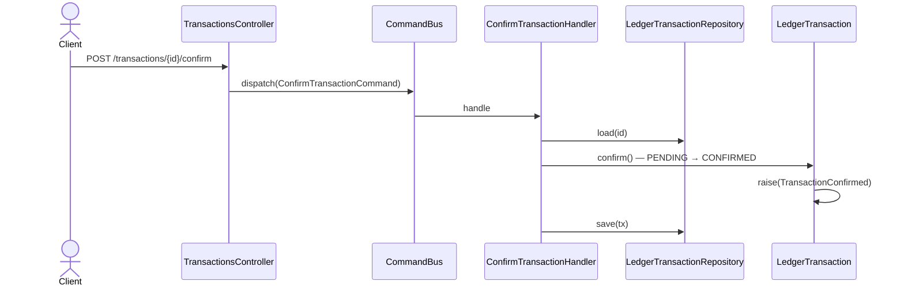

# Confirmar transacción

Transición `PENDING → CONFIRMED`. A partir de la confirmación la transacción es inmutable
(INV-6): ya no admite `amend` ni `void`, solo `annotate` y `reverse`.

**El body se ignora por completo.** El controller declara `_dto:
ConfirmTransactionRequestDto` y despacha `new ConfirmTransactionCommand(id)`: el `postings?`
opcional del DTO no se transporta. Confirmar con postings distintos a los registrados **no
está soportado** — la vía correcta es `amend` mientras la transacción sigue `PENDING`, y
después `confirm`.

## Reglas

- **AC-2:** responde `200 CommandAcceptedDto`; es transición, no creación.
- Confirmar impacta los saldos: `AccountBalancesProjector` mueve el monto de
  `pending_amount` a `confirmed_amount`.
- **Idempotencia:** reenviar con el mismo `external_ref` replaya el resultado original — ver
  [`../../shared/flows/idempotent-write.md`](../../shared/flows/idempotent-write.md).

## Errores

| Condición | Excepción | code | HTTP |
|---|---|---|---|
| Transacción inexistente para el usuario | `TransactionNotFoundException` | `TRANSACTION_NOT_FOUND` | 404 |
| La transacción no está `PENDING` | `InvalidTransactionStateException` | `INVALID_TRANSACTION_STATE` | 409 |
| Sin contexto autenticado | `UnauthorizedException` (`LedgerContextGuard`) | — | 401 |

## Respuesta

`200`: `CommandAcceptedDto { id, streamPosition }` + header `X-Ledger-Stream-Position`.
