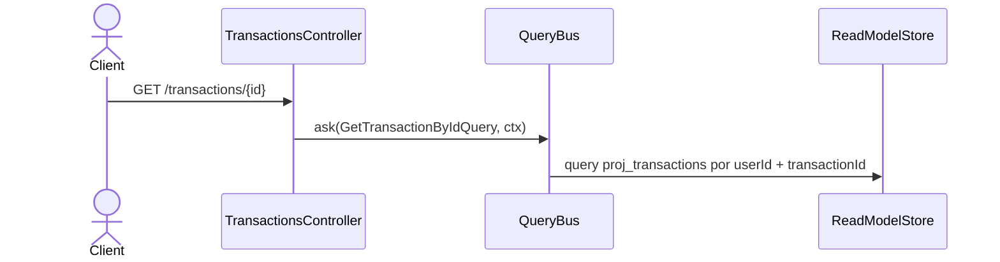

# Consultar una transacción

Devuelve una fila de `proj_transactions`, acotada al usuario del contexto.

**No incluye los postings.** Las líneas de la transacción viven en `proj_postings` y esta
ruta no las cruza: la respuesta trae la cabecera (`transaction_id`, `date`, `payee`,
`description`, `status`, `derived_kind`, `client_id`, …) y nada más. Un cliente que necesite
las líneas debe listarlas aparte.

**Una transacción inexistente responde `200` con cuerpo `null`, no `404`** — mismo patrón
que `GET /accounts/{id}` (`hu-0013`). `TRANSACTION_NOT_FOUND` existe en el catálogo pero lo
emiten los handlers de escritura al cargar una transacción inexistente, no esta lectura.

Devuelve la fila cruda de `proj_transactions` **sin** los postings (viven en
`proj_postings` y esta ruta no los cruza). Una transacción inexistente responde `200` con
cuerpo `null`, no `404` (hu-0014, AC-3).

## Reglas

- **AC-3:** responde `200` con la fila cruda de proyección, o `null`.
- **INV-9:** el filtro por `user_id` va en el criteria, así que el id de otra persona es
  indistinguible de uno inexistente — ambos devuelven `null`. Deseable: no filtra existencia
  entre usuarios.
- **RNF-10:** solo lectura.

## Errores

| Condición | Resultado | HTTP |
|---|---|---|
| Transacción inexistente | Cuerpo `null` | 200 |
| Transacción de otro usuario | Cuerpo `null` (indistinguible) | 200 |
| Sin contexto autenticado | `UnauthorizedException` (`LedgerContextGuard`) | 401 |

## Respuesta

`200`: `TransactionRow` cruda (sin postings), o `null`.
