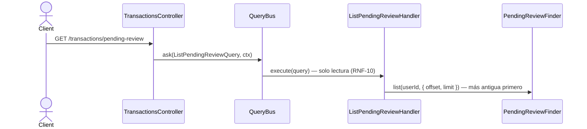

# Listar bandeja de revisión

`ListPendingReviewHandler` sirve la bandeja de revisión (`pending_review`) desde
`proj_pending_review`, scoped al `userId` del contexto (INV-9).

La bandeja es una cola de trabajo: se ordena **más antigua primero** — lo que más
tiempo lleva esperando aparece arriba, al revés que la lista de transacciones, que se
lee como historial y encabeza con lo más reciente.

**La respuesta es un array crudo de vistas, no una página.** El handler devuelve
`readonly PendingReviewView[]` con paginación `offset`/`limit` (default 50); no existe
envoltorio con `total`. Como en `list-transactions`, el cliente detecta el fin cuando
recibe menos filas que el `limit` pedido.

## Reglas

- **Solo `PENDING`.** La proyección `pending_review` solo contiene transacciones que
  esperan revisión; confirmar o anular las saca de la bandeja.
- **INV-9:** `user_id` del contexto filtra estrictamente — cada usuario ve solo su
  propia bandeja.
- **RNF-10:** Solo lectura — el handler no escribe ni accede al `EventStore`.
- **Orden:** más antigua primero, por `date` — es una cola de trabajo, no historial.

## Respuesta

`200`: `PendingReviewView[]` — array crudo, no página. Campos: `transactionId`, `date`,
`payee`, `description`, `postingCount`, `clientId`, `externalRef`. Paginación con
`limit` (default 50) y `offset`.
