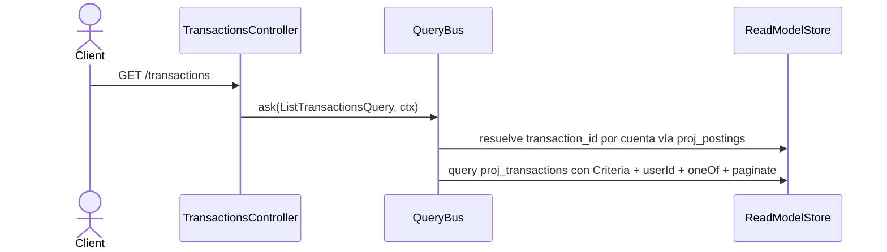

# Listar transacciones

`ListTransactionsHandler` sirve el listado filtrado y paginado de transacciones desde
`proj_transactions`, con filtro opcional por cuenta vía `proj_postings`. Todo scoped al
`userId` del contexto (INV-9).

**La respuesta es un array crudo, no una página.** El handler devuelve
`readonly TransactionRow[]`; no existe envoltorio con `total`/`limit`/`offset`. El
`TransactionListDto` decora Swagger vía `@ApiOkResponse` pero **no se construye**:
`queryBus.ask<TransactionListDto>(...)` es un genérico sin verificación. Sin `total`, el
cliente detecta el fin de la colección cuando recibe menos filas que el `limit` pedido
(hu-0014, AC-3).

El filtro por cuenta resuelve primero los `transaction_id` desde `proj_postings` y los
aplica dentro del criteria (`oneOf`) **antes** de paginar; aplicarlo después ocultaba
coincidencias más allá de la primera página (hu-0014). La respuesta es un array crudo de
filas, no una página con total.

## Reglas

- **AC-6 (RF-13):** Filtros combinables: `status`, `derivedKind`, `payee`, `clientId`,
  `from`/`to` (rango de fecha contable) y `account`. El query string usa `from`/`to`, no
  `period`.
- **Filtro por cuenta antes de paginar (hu-0014):** `account` resuelve primero los
  `transaction_id` que tienen un posting en esa cuenta (`proj_postings`) y los aplica como
  `oneOf('transaction_id', ids)` **dentro del criteria**, antes de la paginación. Aplicarlo
  después habría extraído una página de todas las cuentas para luego adelgazarla, ocultando
  coincidencias más allá de la primera página. Si la cuenta no tiene postings, el handler
  cortocircuita y devuelve `[]` — necesario porque `Criteria.oneOf` con array vacío no
  agrega filtro y habría devuelto *todas* las transacciones.
- **AC-8 (INV-9):** `userId` del `QueryContext` se aplica siempre como filtro `equals`
  en el `Criteria`; no es opcional ni visible al caller.
- **RNF-10:** Solo lectura — el handler no invoca `EventStore`, `upsert`, `delete`, ni
  produce efectos secundarios.
- **Paginación:** `paginate({ offset, limit })` siempre se aplica. `limit` por defecto es
  **50** (`DEFAULT_TRANSACTION_PAGE_SIZE`) y el máximo **200**
  (`MAX_TRANSACTION_PAGE_SIZE`), así que una lectura sin parámetros queda acotada en vez de
  devolver la tabla entera.
- **Orden:** Por defecto `date DESC` (más recientes primero).

## Errores

| Condición | Excepción | HTTP |
|---|---|---|
| Query type sin handler registrado | `UnregisteredQueryException` | Depende del controller (no en scope EP-1) |

## Respuesta

`200`: `TransactionRow[]` — lista de transacciones que cumplen los filtros, cada una con
`transaction_id`, `user_id`, `date`, `payee`, `status`, `derived_kind`, `client_id`, etc.
