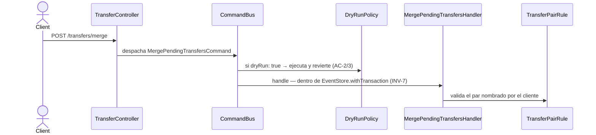

# Fusionar patas de transferencia

Une dos transacciones pendientes —la salida de una cuenta y la entrada en otra— en una
única transferencia. `TransferController` construye el `MergePendingTransfersCommand`
desde el body (`pendingIds`, `dryRun`) y lo despacha al `CommandBus`.

**Detectar *qué* pendientes fusionar es del cliente, no del ledger.** RF-15 salió del
alcance en la versión 0.8 de la spec (§4.2): este flujo valida el par que el cliente le
nombra, no busca candidatos. `TransferPairRule` es quien decide si el par es fusionable.

> Este flow se creó en spec-0033. El caso de uso existía desde hu-0025 con su handler, su
> regla de dominio y su evento, pero solo estaba documentado como `dynamic view` en el
> modelo LikeC4, sin doc propia.

## Reglas

- **El par lo nombra el cliente.** El ledger no infiere candidatos de transferencia; solo
  valida el par recibido con `TransferPairRule`.
- **Los appends comparten transacción** (INV-7). En modo dry-run ese scope es el de
  `DryRunPolicy` y revierte entero.
- **Ambas patas deben estar `PENDING`.** Una transacción ya confirmada o anulada no se
  fusiona.
- **El resultado emite `TransfersMerged`**, que las proyecciones consumen para reflejar la
  transferencia como una sola operación.

## Errores

| Condición | Excepción | HTTP |
|---|---|---|
| Alguna de las transacciones no existe | `TransactionNotFoundException` | 404 |
| El par no cumple la regla de transferencia | `InvalidTransactionStateException` | 409 |
| Alguna no está `PENDING` | `InvalidTransactionStateException` | 409 |
| Reintentos transitorios agotados | `PersistenceConflictException` | 409 |

## Respuesta

`201 Created` con `CommandAcceptedDto` y el header `X-Ledger-Stream-Position`. Con
`dryRun: true`, el preview del resultado real ya revertido — ver
[`../../shared/flows/dry-run-preview.md`](../../shared/flows/dry-run-preview.md).
