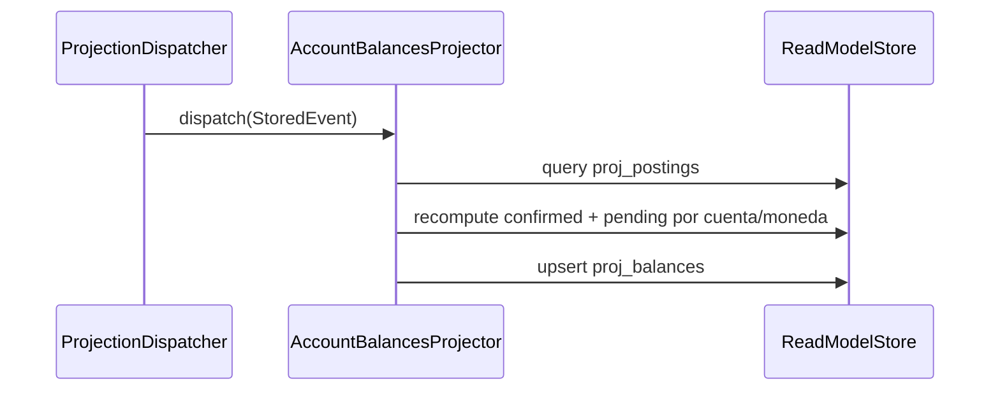

# Proyectar account_balances

El `AccountBalancesProjector` mantiene `proj_balances` con saldos confirmados y
pendientes por cuenta y moneda, recomputando desde `proj_postings`. Debe ejecutarse
**después** de `TransactionListProjector` en el orden del dispatcher, porque consume
los postings que este último escribe.

## Reglas

- **AC-3:** `confirmed_amount` y `pending_amount` se mantienen por separado para cada
  par `(account_id, currency_code)`. Una transacción multi-moneda produce una fila por
  cada moneda distinta entre sus postings.
- **AC-4 / RNF-5:** La recomputación desde `proj_postings` (no delta incremental) hace
  que el proyector sea naturalmente idempotente: proyectar los mismos eventos dos veces
  produce el mismo estado final.
- **INV-5:** `proj_balances` es el único productor de saldos — ningún command escribe
  directamente en esta tabla.
- **Recompute:** Para cada par `(accountId, currencyCode)` afectado, consulta todos los
  postings de esa cuenta+moneda, suma montos con status `CONFIRMED` en `confirmed_amount`
  y con status `PENDING` en `pending_amount`. Luego hace upsert en `proj_balances`.

## Errores

| Condición | Excepción | Efecto |
|---|---|---|
| `proj_postings` sin filas para la transacción | Ninguna | `affectedPairs` retorna vacío — sin cambios en balances |

## Respuesta

Sin respuesta directa (proyector reactivo). El efecto observable es el estado actualizado en
`proj_balances`:
- `confirmed_amount`: suma de postings en status `CONFIRMED`.
- `pending_amount`: suma de postings en status `PENDING`.
- `updated_at`: timestamp del evento procesado (LWW).
