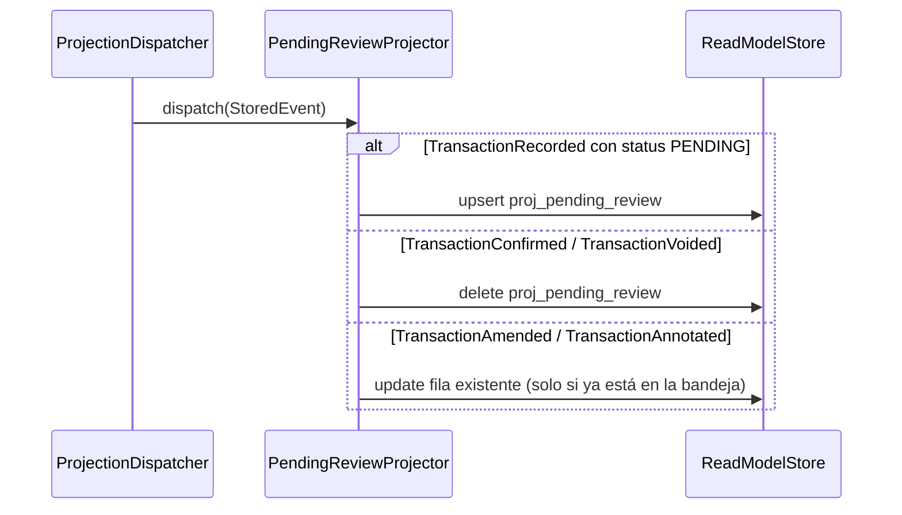

# Proyectar pending_review

El `PendingReviewProjector` mantiene `proj_pending_review` — la bandeja de revisión del
frontend. Guarda una fila por cada transacción `PENDING` y la elimina en el momento en
que se confirma o se anula.

A diferencia de `proj_transactions`, que crece por toda la vida del ledger,
`proj_pending_review` solo contiene lo que efectivamente espera revisión: la bandeja
sigue barata a medida que el historial acumula. No lleva postings a propósito: la
bandeja lista qué necesita atención, y el detalle lo lee de la transacción misma.

## Reglas

- **La bandeja solo tiene `PENDING`.** Una transacción registrada directamente como
  `CONFIRMED` nunca entra a la bandeja.
- **Confirmar o anular saca de la bandeja.** El `TransactionConfirmed` y el
  `TransactionVoided` eliminan la fila.
- **Amend/annotate solo refrescan filas existentes.** La anotación es legal sobre una
  transacción `CONFIRMED` (INV-6), y esa no debe reaparecer en la bandeja.
- **RNF-10 / INV-9:** proyección reactiva scoped por `user_id`; ninguna query cruza
  datos entre usuarios.
