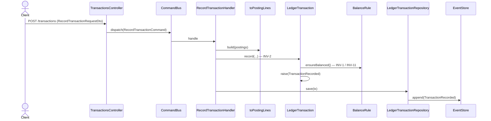

# Registrar transacción

Crea un asiento contable (PENDING o CONFIRMED). El `RecordTransactionHandler` arma los
`PostingLine` con la `PostingFactory` y construye el agregado vía `LedgerTransaction.record(...)`,
que exige el balanceo a cero por moneda antes de emitir `TransactionRecorded`.

## Reglas

- **INV-2:** al menos 2 postings.
- **INV-1 / INV-11:** la suma por moneda debe ser cero (`ZeroSumBalanceRule`).
- **INV-8:** montos como string decimal exacto.
- `status` de creación: PENDING o CONFIRMED (nunca VOIDED).

## Errores

| Condición | HTTP |
|---|---|
| Menos de 2 postings (INV-2) o desbalance (INV-1) | 422 |

## Respuesta

`201 Created` con `CommandAccepted` (`id`, `streamPosition`).

## Efectos posteriores (asíncronos)

Al persistirse `TransactionRecorded`, el `TransferCandidatesProjector` evalúa el evento
para la detección de transferencias — ver [detect-transfer](./detect-transfer.md).
