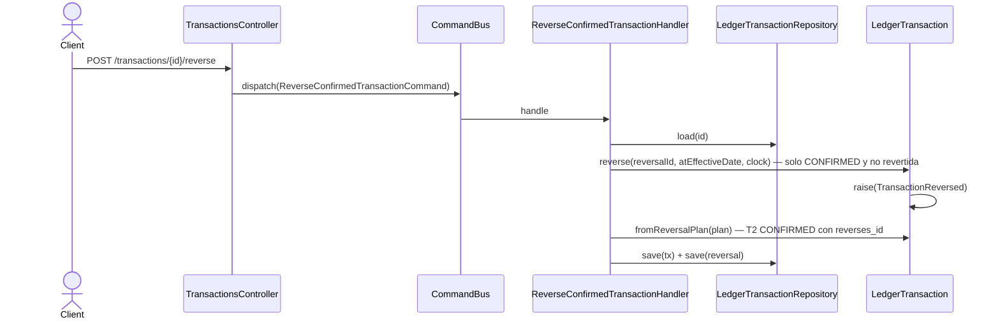

# Reversar transacción confirmada

Anula el efecto contable de una transacción ya `CONFIRMED` **sin mutarla**: crea una
transacción de reversa (T2) con los postings invertidos y `metadata.reverses_id = {id}`
apuntando a la original (§7.3). El stream permanece inmutable — la original queda tal cual
en su historia. Los dos appends corren dentro de `EventStore.withTransaction` (INV-7).

Es el único endpoint del ciclo de vida que responde **`201`**, porque crea un agregado
nuevo. **Devuelve el id de la reversa (T2), no el de la original** — un detalle fácil de
pasar por alto al integrar.

**El `reason?` del body se ignora.** El controller no lo persiste: a diferencia de `void`,
el motivo no queda registrado. El campo sigue en el DTO y en el contrato para no romper
clientes, pero no tiene efecto.

**Delta hu-0025 (AC-4):** el body acepta `dryRun: boolean` (default `false`) — ejecuta el
comando completo (incluida la reversa dentro de su `withTransaction`, que en modo dry-run
se une al scope de la política y revierte) y hace rollback, devolviendo el resultado real.
Ver [`../../shared/flows/dry-run-preview.md`](../../shared/flows/dry-run-preview.md).
*Nota de reconciliación: esta nota se agrega recién en hu-0026 — el flow doc no se había
actualizado cuando hu-0025 cerró.*

**Delta hu-0026 — la fecha de T2 se elige, y la doble reversa tiene código propio.**

1. **`atEffectiveDate: boolean` en el body (AC-1, AC-4).** Elige con qué fecha contable nace
   T2. Default `true`, que es el comportamiento previo, así que el contrato sigue siendo
   compatible con quien no conozca el campo.
2. **La fecha se decide en un solo lugar.** Hasta hu-0026 el agregado devolvía un
   `ReversalPlan` con la fecha que el handler descartaba, reconstruyendo la reversa por su
   cuenta: dos fuentes de verdad para el mismo dato. Ahora
   `LedgerTransaction.reverse(reversalId, atEffectiveDate, clock)` resuelve la fecha dentro
   del plan, y el handler construye T2 con `LedgerTransaction.fromReversalPlan(plan, balance)`.
3. **`TRANSACTION_ALREADY_REVERSED` (409, AC-3).** La doble reversa deja de responder el
   genérico `INVALID_TRANSACTION_STATE`.

Ningún evento cambia de esquema: la elección es observable como el `date` del
`TransactionRecorded` de T2, al que `TransactionReversed.reversalId` apunta.

## Reglas

- **AC-2:** responde `201 CommandAcceptedDto` cuyo `id` es el de la transacción de reversa.
- Solo en `CONFIRMED`. Una `PENDING` se anula con `void`, no se reversa.
- **AC-1 · `atEffectiveDate: true` (default)** — T2 nace con la **fecha contable de la
  original**. Corrige el saldo histórico; las aserciones de saldo posteriores a esa fecha se
  re-evalúan automáticamente (RF-18).
- **AC-1 · `atEffectiveDate: false`** — T2 nace con la **fecha de hoy**, obtenida como
  `clock.now()` truncado a `YYYY-MM-DD` en **UTC** (`LedgerDate.today(clock)`). El saldo
  histórico queda intacto y las aserciones anteriores a hoy no cambian de veredicto.
- **RF-18 es consecuencia, no implementación.** Las dos ramas emiten el mismo
  `TransactionRecorded` y entran por el mismo camino: `ReevaluateAssertionsReactor` ya lo
  consume (`TransactionReversed` está deliberadamente fuera de `REEVALUATION_TRIGGERS`). Lo
  único que cambia es la fecha del evento y, por lo tanto, qué aserciones quedan alcanzadas.
- **El ledger no infiere el cierre de período.** No existe tal concepto en el modelo: elegir
  es del cliente y el ledger obedece, sin validar ni sugerir.
- **Sin coherencia temporal impuesta.** No se compara la fecha de hoy con la de la original:
  si la original está fechada a futuro, T2 puede quedar fechada antes que ella, y se acepta.
- **INV-6 intacto.** Lo que se elige es la fecha de la transacción **nueva**; los atributos
  económicos de la original siguen siendo inmutables.
- **AC-3 · una sola reversa por transacción.** El flag `reversed` del agregado sigue
  impidiendo la segunda; lo que cambia es el código con que se rechaza.
- **AC-5 · idempotencia.** `atEffectiveDate` es un input del comando, no metadata de
  transporte: entra al hash de `IdempotencyPolicy` (`canonicalJson({ userId, command })`) por
  construcción. El controller resuelve el default antes de construir el command, de modo que
  el mismo request produzca siempre el mismo hash.
- **AC-4 (hu-0025):** `dryRun` sigue siendo metadata de transporte (va en el `AuthContext`),
  fuera del hash de idempotencia.
- **Idempotencia:** ver [`../../shared/flows/idempotent-write.md`](../../shared/flows/idempotent-write.md).

## Errores

| Condición | Excepción | code | HTTP |
|---|---|---|---|
| **NUEVO (hu-0026)** — la transacción ya fue revertida | `TransactionAlreadyReversedException` | `TRANSACTION_ALREADY_REVERSED` | 409 |
| La transacción no está `CONFIRMED` por otro motivo (PENDING, VOIDED) | `InvalidTransactionStateException` | `INVALID_TRANSACTION_STATE` | 409 |
| Misma `external_ref` con inputs distintos — incluye otro `atEffectiveDate` (AC-5, hu-0026) | `IdempotencyInputMismatchException` | `IDEMPOTENCY_INPUT_MISMATCH` | 409 |
| **NUEVO (hu-0025)** — reintentos transitorios agotados | `PersistenceConflictException` | `PERSISTENCE_CONFLICT` | 409 |
| Transacción inexistente para el usuario | `TransactionNotFoundException` | `TRANSACTION_NOT_FOUND` | 404 |

> El reparto de `INVALID_TRANSACTION_STATE` es lo único que cambia respecto de hu-0014: hasta
> hu-0026 ese código cubría también la doble reversa. Sigue vigente para el resto de los
> estados no reversables.

## Respuesta

- **201:** `CommandAcceptedDto { id, streamPosition }` + header `X-Ledger-Stream-Position`,
  donde `id` es **la transacción de reversa (T2)**. Con `dryRun: true` es el preview del
  resultado real, ya revertido.
- **200:** replay idempotente (hu-0024) — misma `external_ref`, mismos inputs.
