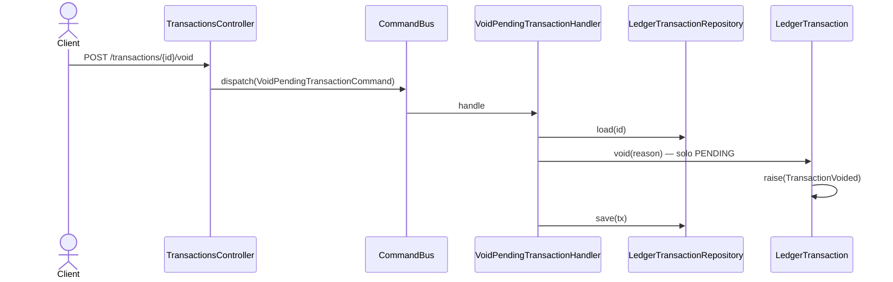

# Anular transacción pendiente

Descarta una transacción que nunca llegó a confirmarse. Solo válido en `PENDING`: una
transacción `CONFIRMED` no se anula, se **reversa** (ver
[`reverse-transaction.md`](./reverse-transaction.md)), porque su efecto contable ya ocurrió
y el stream es inmutable.

A diferencia de `confirm` y `reverse`, acá el body **sí** se transporta: `reason` es
requerido y viaja al command.

## Reglas

- **AC-2:** responde `200 CommandAcceptedDto`.
- Solo en `PENDING`. Anular libera el `pending_amount` que la transacción reservaba en los
  saldos de sus cuentas.
- El `reason` queda en el evento `TransactionVoided` como rastro de auditoría.
- **Idempotencia:** ver [`../../shared/flows/idempotent-write.md`](../../shared/flows/idempotent-write.md).

## Errores

| Condición | Excepción | code | HTTP |
|---|---|---|---|
| `reason` ausente | `ValidationPipe` (class-validator) | — | 400 |
| Transacción inexistente para el usuario | `TransactionNotFoundException` | `TRANSACTION_NOT_FOUND` | 404 |
| La transacción no está `PENDING` (p.ej. ya `CONFIRMED`) | `InvalidTransactionStateException` | `INVALID_TRANSACTION_STATE` | 409 |

## Respuesta

`200`: `CommandAcceptedDto { id, streamPosition }` + header `X-Ledger-Stream-Position`.
