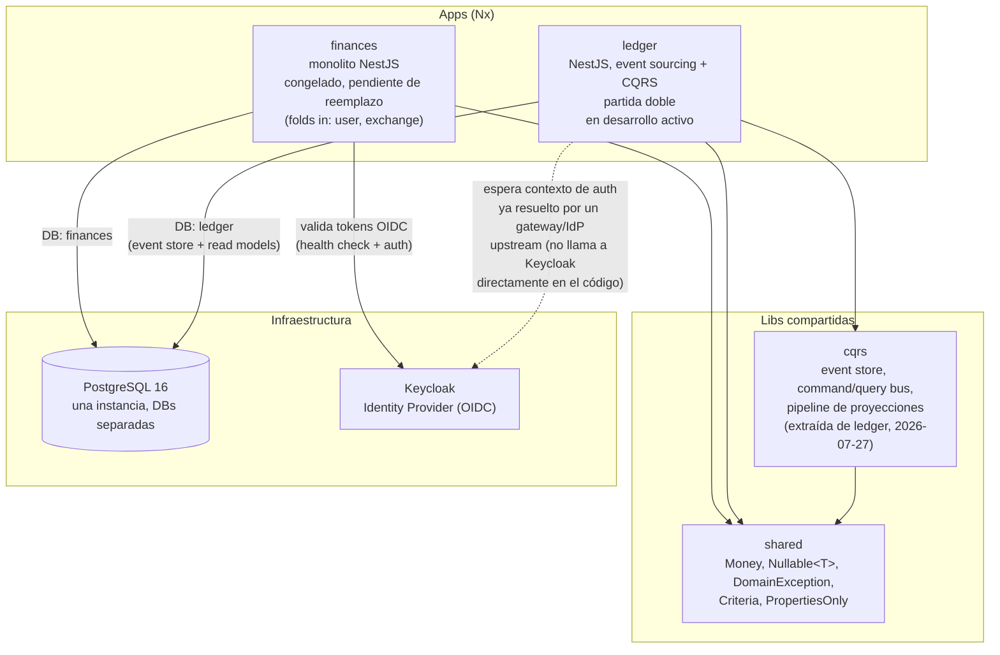

# Diagrama de Contenedores — admin-back (C4 Nivel 2)

> Vista de contenedores: apps/microservicios, libs compartidas, bases de
> datos e integraciones externas. Generado por `/architecture` (bootstrap) y
> actualizado quirúrgicamente por `/architecture` en modo Update, invocado
> desde `/sync` cuando una historia toca arquitectura global.
> Última actualización: 2026-08-11 (spec-0033 — migración a Mermaid; se
> incorporó `libs/cqrs`, ausente desde su extracción en julio).

## Notas

- **`finances`** es el monolito original (incluye los módulos plegados `user`
  y `exchange`), congelado a la espera de que `ledger` lo reemplace por
  completo — no recibe funcionalidad nueva, solo mantenimiento si algo se
  rompe.
- **`ledger`** es el reemplazo event-sourced + CQRS + partida doble, en
  desarrollo activo. Es el único destino de historias nuevas hoy.
- Ambas apps comparten una única instancia de PostgreSQL (`docker-compose.yml`,
  puerto `5433`) pero con **bases de datos separadas** (`finances`, `ledger`)
  — no hay una DB compartida entre servicios.
- **Keycloak** es el único sistema externo real hoy. `finances` lo integra
  directamente (validación de token + health check). `ledger` no lo llama en
  código: su `ledger-context.guard` asume que el `userId`/`clientId` ya llegó
  resuelto por la infraestructura externa (gateway/servicio de identidad) —
  ver RF-26/RF-12 de `especificacion-tecnica-ledger.md`.
- **`libs/cqrs`** contiene la maquinaria de event sourcing y CQRS: event store
  append-only, buses de comando y consulta, y el pipeline de proyecciones. Se
  extrajo de `apps/ledger/src/shared-kernel` el 2026-07-27 y es deliberadamente
  ignorante de qué se registra — conoce streams, envelopes y posiciones, nunca
  cuentas ni dinero. Su documentación vive en
  [`libs/cqrs/README.md`](../../libs/cqrs/README.md) y
  [`libs/cqrs/docs/flows/`](../../libs/cqrs/docs/flows/).
- No hay lib `core` pese a lo que menciona `CLAUDE.md`. Hoy existen
  `libs/shared` y `libs/cqrs`.

> **Nivel 3.** Los componentes internos de cada módulo no viven acá: cada uno
> tiene su `flowchart` en el `README.md` de su unidad de documentación
> (`apps/ledger/docs/<módulo>/`, `libs/cqrs/`), y cada caso de uso su
> `sequenceDiagram` inline en `flows/`. Ver
> [`docs/proposals/docs-as-code-mermaid.md`](../proposals/docs-as-code-mermaid.md).
