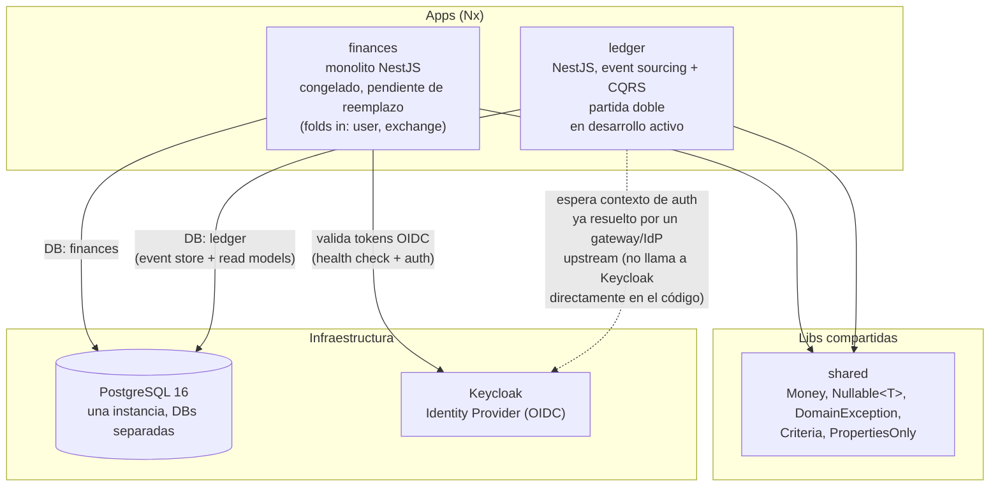

# Diagrama de Contenedores — admin-back (C4 Nivel 2)

> Vista de contenedores: apps/microservicios, libs compartidas, bases de
> datos e integraciones externas. Generado por `/architecture` (bootstrap) y
> actualizado quirúrgicamente por `/architecture` en modo Update, invocado
> desde `/sync` cuando una historia toca arquitectura global.
> Última actualización: 2026-07-23 (bootstrap inicial).

## Notas

- **`finances`** es el monolito original (incluye los módulos plegados `user`
  y `exchange`), congelado a la espera de que `ledger` lo reemplace por
  completo — no recibe funcionalidad nueva, solo mantenimiento si algo se
  rompe.
- **`ledger`** es el reemplazo event-sourced + CQRS + partida doble, en
  desarrollo activo. Es el único destino de historias nuevas hoy.
- Ambas apps comparten una única instancia de PostgreSQL (`docker-compose.yml`,
  puerto `5433`) pero con **bases de datos separadas** (`finances`, `ledger`)
  — no hay una DB compartida entre servicios.
- **Keycloak** es el único sistema externo real hoy. `finances` lo integra
  directamente (validación de token + health check). `ledger` no lo llama en
  código: su `ledger-context.guard` asume que el `userId`/`clientId` ya llegó
  resuelto por la infraestructura externa (gateway/servicio de identidad) —
  ver RF-26/RF-12 de `especificacion-tecnica-ledger.md`.
- No hay libs `core` pese a lo que menciona `CLAUDE.md` — al momento de este
  bootstrap (2026-07-23) solo existe `libs/shared`. Si esto cambió, actualizar
  esta nota y el diagrama.
