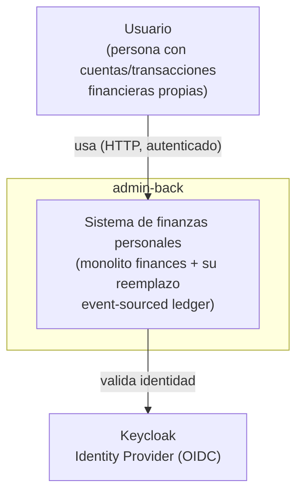

# Diagrama de Contexto — admin-back (C4 Nivel 1)

> Vista de contexto de sistema: quién usa el sistema y con qué sistemas
> externos interactúa, sin ningún detalle interno (ni apps, ni DBs, ni
> módulos). Generado por `/architecture` (bootstrap) y actualizado
> quirúrgicamente en modo Update cuando una historia agrega/quita un actor o
> una integración externa real.
> Última actualización: 2026-07-23 (bootstrap inicial).

## Notas

- El sistema se representa como una única caja (`admin-back`) en este nivel —
  la separación interna entre `finances` y `ledger` es una decisión de
  contenedores (ver `containers.md`), invisible para un actor externo.
- **Keycloak** es, al día de este bootstrap, el único sistema externo real con
  el que `admin-back` integra (autenticación). No hay bancos, pasarelas de
  pago ni proveedores de datos financieros integrados todavía.
- Si se agrega un actor nuevo (ej. un sistema externo que consume el ledger
  vía webhook) o se pierde uno existente, este archivo se actualiza —
  `containers.md` es el que absorbe la mayoría de los cambios de una historia
  normal.
