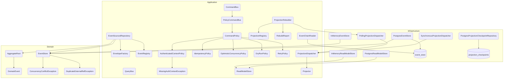

# cqrs

Event sourcing and CQRS machinery: an append-only event store, the command and
query buses, and the projection pipeline. It is deliberately ignorant of what is
being recorded — it knows about streams, envelopes and positions, never about
accounts or money.

Extracted from `apps/ledger/src/shared-kernel` on 2026-07-27. See
[`docs/decisions.md`](../../docs/decisions.md) for the reasoning.

## What lives here

| Area | Contents |
|---|---|
| `domain/aggregate` | `AggregateRoot`, `DomainEvent` |
| `domain/event` | Envelope, stored event, stream id, append result |
| `domain/ports` | `EventStore`, `Clock`, `IdGenerator` |
| `application/command-bus` | Bus plus the authenticated-context, idempotency and optimistic-concurrency policies |
| `application/query-bus` | Query bus and handler contract |
| `application/event` | Envelope factory, event registry (schema versions, upcasting) |
| `application/projection` | `Projector`, `ReadModelStore`, dispatcher, checkpoints |
| `infrastructure/adapters` | PostgreSQL and in-memory implementations of every port, plus `SystemClock` and `UuidIdGenerator` |
| `infrastructure/adapters/migrations` | The `event_store` and `projection_checkpoints` schema |
| `infrastructure/adapters/http` | Accepted-command response, stream-position header, idempotency-key decorator |
| `infrastructure/testing` | Contract suites both adapters must pass |
| `testing` | Deterministic `Clock` / `IdGenerator` doubles and a recording command bus |

## Schema ownership

The `event_store` and `projection_checkpoints` migrations ship here, not with a
consumer: they are the schema `PostgresEventStore` needs to work at all, and an
app that owned them could drift from the adapter that reads them. A consumer
adds this directory to its TypeORM `migrations` glob ahead of its own — see
`apps/ledger/src/database/data-source.ts`. Both sets share one migrations table,
and these timestamps come first.

## What deliberately stays in the app

The authenticated-context machinery (`LedgerContext`, its guard and the gateway
header resolver) looks generic but encodes a contract with a specific identity
service, so it belongs to whoever holds that contract. This library only takes
the `AuthContext` shape the buses need — `userId`, `clientId`, `externalRef` —
and never learns where those values came from.

## The rule that defines this library

**It never imports from an application.** No `@ledger/*`, no `@app/*`.

That rule is the whole point. Before the split, this same folder held
`AccountName`, `Payee`, a currency catalog and a balance verifier next to the
event store: infrastructure that had quietly learnt double-entry bookkeeping.
Those moved back into `apps/ledger`.

`domain-independence.spec.ts` walks the sources and fails on any import from an
application. It is the effective guard: the Nx tag constraint
(`type:infra` → `type:infra`) is declared in `eslint.config.mjs`, but the
workspace's pre-existing `allow: ['@ledger/**']` — needed so each app can reach
its own files through its alias — bypasses tag checks, so the rule does not bite
on its own.

## Components (C4 level 3)

Nodes name the real class; the CI gate (`npm run docs:validate`) fails if any of them
stops existing. Cylinders are tables, not classes.

**Flows:** see [`docs/flows/`](./docs/flows/) — each carries its own inline
`sequenceDiagram`.

> The `PostgresReadModelStore` contract suite (`infrastructure/testing`) verifies the
> upsert / delete / query / truncate semantics that both adapters must honour. It is a
> test, not a runtime component, so it is named here rather than drawn as a node.

## Consumers

`apps/ledger` via the `@cqrs/*` path alias. Adding a consumer means giving it
the alias in its `tsconfig.json` `paths` and a `moduleNameMapper` entry in its
Jest config, mirroring what `apps/ledger` does.

## Known coupling

Production code depends on `@shared` for `Nullable`, `Criteria` and the
`DomainException` hierarchy. That barrel also re-exports an auth module, which
drags `jwks-rsa` → `jose` (ESM only) into the CJS test runner — hence the
`transformIgnorePatterns` entry in `jest.config.ts`. Narrowing the import to the
specific entry points would remove the workaround.
