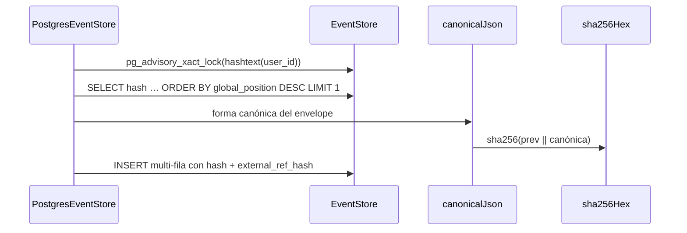

# Append encadenado al event store

Cómo un batch de eventos llega a `event_store` con su cadena de hashes intacta. Antes de
hu-0024 el append era un `INSERT` multi-fila transaccional; ahora, además, cada evento se
encadena criptográficamente con el anterior **del mismo usuario**, dentro de la misma
operación atómica.

La cadena vive entera en el adaptador `PostgresEventStore`: es defensa en profundidad, igual
que el trigger append-only, y el núcleo no sabe que existe. Ningún agregado, handler ni
projector conoce el hash.

## Recorrido

1. **Serializar por usuario.** Primera sentencia del append, dentro de la transacción ya
   abierta: `SELECT pg_advisory_xact_lock(hashtext($userId))`. Postgres lo libera solo en el
   commit o el rollback, y es re-entrante para la misma transacción — así que un
   `withTransaction` que appendea a varios streams del mismo usuario toma el lock una vez.
2. **Leer la cabeza.** `SELECT hash FROM event_store WHERE user_id = $1 ORDER BY global_position
   DESC LIMIT 1`, servido por el índice `idx_event_user (user_id, global_position)` que ya
   existía. Dentro de una transacción, esta lectura **ve los appends previos de la misma
   transacción**, que es lo que hace correcto el caso cross-stream.
3. **Encadenar en orden.** Para cada evento del batch, en el orden en que llega:
   `hash_n = sha256Hex(hash_{n-1} || canonicalJson(chainHashInput(evento_n)))`. El primer evento
   de un usuario encadena contra la **cadena vacía** `""`.
4. **Insertar.** Un único `INSERT … VALUES (…), (…)` que ahora lleva 14 columnas por fila:
   las 12 de siempre más `hash` y `external_ref_hash`.

## Reglas

- **AC-1 (canonicalización):** `canonicalJson` sigue **JCS — RFC 8785** vía `canonicalize@3.0.0`.
  Claves ordenadas por code unit UTF-16, salida compacta, escapes mínimos, números ECMAScript.
  La implementación se valida contra los vectores de prueba oficiales del RFC. Los montos ya
  llegan como strings decimales en el payload (RNF-2 / INV-8), así que nunca se serializan como
  `number`.
- **AC-2 (cadena por usuario):** el "evento anterior" es el último de ese `user_id`, no el último
  global (INV-9). El hash se guarda como texto hexadecimal en minúscula de 64 caracteres
  (`char(64)`), legible tal cual en logs y en el reporte de `verify-chain`.
- **AC-2 (atomicidad):** el cálculo ocurre dentro de la transacción del append. El hash y el
  evento se persisten juntos o se pierden juntos (INV-7). No hay ventana en la que exista un
  evento sin su hash.
- **AC-3 (qué entra al hash):** el input se define **por exclusión**, no por enumeración por tipo
  de evento. Entra el `payload` completo más los campos del envelope; se excluyen `recordedAt`,
  `globalPosition` y `externalRefHash`. `occurredAt` se serializa como ISO 8601 antes de
  canonicalizar (`Date` no es JSON-safe).
- **AC-3 (garantía de compilación):** la exclusión no es una lista en runtime sino una función de
  proyección `chainHashInput(envelope): ChainHashInput`, con `ChainHashInput` derivado por
  `Omit<EventEnvelope, …>`. Agregar un campo al envelope rompe la compilación hasta que alguien
  decida si entra o se excluye — que es exactamente lo que AC-3 pide.
- **Por qué se excluye `externalRefHash`:** es un derivado. Si cambiara la canonicalización de los
  inputs del command, todos los `external_ref_hash` cambiarían y la cadena histórica entera
  quedaría inválida — el modo de falla que AC-3 existe para prevenir.
- **AC-8 (sin nulos):** `hash` es `NOT NULL`. Un evento sin hash es un estado que la base no puede
  representar, así que no existe rama de tolerancia en ningún lado.
- **INV-12:** la tabla sigue siendo append-only; el trigger `trg_event_store_immutable` rechaza
  todo `UPDATE`/`DELETE`. El encadenamiento no reescribe nada: solo agrega columnas al `INSERT`.
- **Paridad de adaptadores:** `InMemoryEventStore` encadena idénticamente. El contract test
  compartido verifica las mismas propiedades contra los dos, así que ningún test pasa en memoria
  y falla en Postgres.

## Errores

| Condición | Excepción | Comportamiento |
|---|---|---|
| `expectedVersion` desactualizado (INV-7) | `ConcurrencyConflictException` | Nada persiste; el lock se libera en el rollback |
| Secuencia duplicada dentro del batch | `ConcurrencyConflictException` | Rollback completo — ningún evento del batch, ningún hash |
| `external_ref` ya usada por el usuario | `DuplicateExternalRefException` | Violación del índice único; contrato del puerto |
| `external_ref_hash` presente sin `external_ref` (o al revés) | Violación del CHECK | Bug de programación: el CHECK lo vuelve irrepresentable |
| Batch vacío | — | No-op: retorna sin tomar el lock ni tocar la base |

## Respuesta

`AppendResult { events, version, lastPosition }` — sin cambios de forma. El `hash` **no** sube a
`StoredEvent`: es un derivado del almacenamiento, no un hecho del dominio. Para leerlo existe el
puerto `EventChainReader` (ver [`verify-chain.md`](./verify-chain.md)).

## Riesgo conocido

Dos transacciones que appendearan para los usuarios A y B en orden opuesto podrían deadlockear
sobre los advisory locks. No es alcanzable hoy: INV-9 garantiza que un command pertenece a un
único usuario, así que ninguna transacción toma dos locks de usuario. Si algún día existiera una
operación multi-usuario, habría que tomar los locks en orden determinístico de `user_id`.
